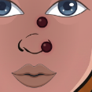
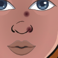
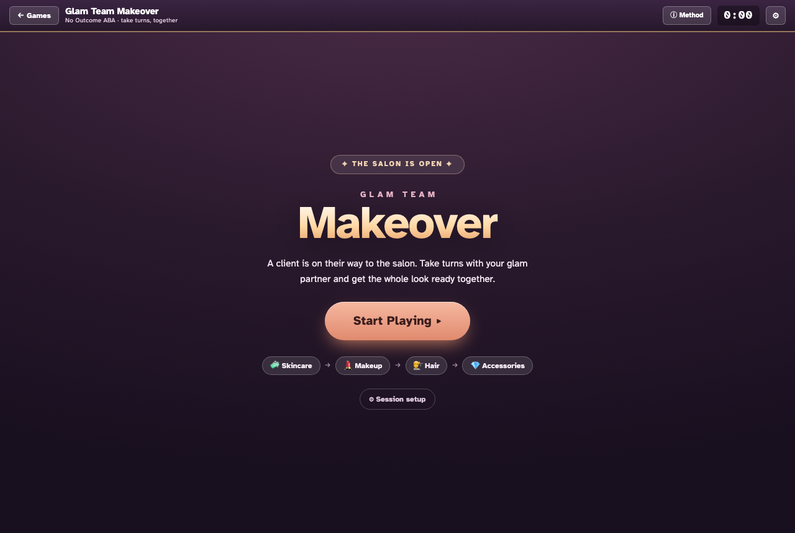
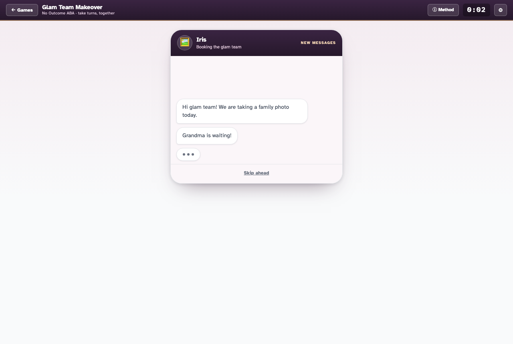
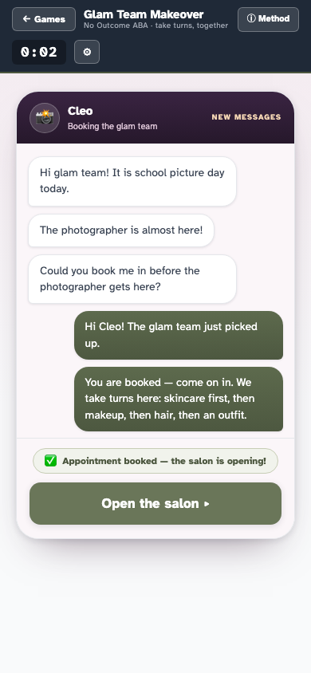

# Glam Team Makeover — Tier 1 build report

**Branch:** `feat/glam-turn-taking-redesign` · **File under change:** `apps/games/glam-team-makeover/index.html`
**Specs added:** `apps/games/tests/glam-tt-scoring.spec.js`, `apps/games/tests/glam-tt-story.spec.js`, `apps/games/tests/glam-tt-game.spec.js`, `apps/games/tests/glam-art-fidelity.spec.js`
**Spec updated:** `apps/games/tests/glam-team-makeover.spec.js`
**Authority:** `docs/glam-team-makeover-redesign-hardened-claims.md` (AC-1…AC-27) — wins over spec prose.
**Date:** 2026-07-25 (pass 3)

> **Status: Tier 1 landed, played, and swept.** Pass 1 built the measurement spine (`window.GlamTT`)
> and the story pool (`window.GlamStory`) and verified them in isolation; the game's screens
> still ran the pre-redesign turn loop. **Pass 2 wired the screens to the engine** and added
> `tests/glam-tt-game.spec.js`, which drives the criteria through real buttons on the real
> game rather than through the engine's API. **Pass 3 closed the visual-fidelity sweep (§3.9)** —
> the item pass 2 listed as the main outstanding one — and added
> `tests/glam-art-fidelity.spec.js`, which settles it by measuring pixels rather than by
> eyeballing screenshots. Every row in §2 below names a test that reproduces it; nothing is
> inferred from reading code. What is still outstanding is listed, unhedged, in §5.

**Test status:** `npx playwright test` → **252 passed** (chromium · firefox · webkit), 0 failed.

---

## 1. What landed

### 1.1 The turn-taking measurement engine (`window.GlamTT`)

The clinical spine, added to `index.html` as a pure, DOM-free, **clock-injected** module. It decides
whether the learner's relinquish (the pass) and their mand for the turn back (the ask-back) were
independent or prompted, and it is the append-only event log the per-turn table renders from.

It is deliberately separable from React and from the DOM. That is what makes all 27 criteria
testable at exact wait-window boundaries instead of racing real timers — the hardened claims turn on
distinctions like "pass at t=2s vs t=5s with a 3s window", which cannot be asserted reliably against
a live 1s interval.

Implemented rules, each traceable to the attack it closes:

| Rule | Claim | Closes |
|---|---|---|
| Possession floor: `independent` needs ≥1 engaged action; a 0-action pass is `no-engagement` | D-A / AC-20 | C2 |
| Budget is a **cap, not a quota** — pass available throughout the turn, early pass scored | D-A / AC-19 | B3 |
| Wait-window anchored to **possession-taken + no-relinquish idle**, not budget-exhaustion | D-A / AC-1 | D1 |
| Independence gated on **any** prompt — app faded cue **or** BT real prompt | D-A / AC-2, AC-21 | D1 |
| Forfeit flag is **turn-durable** for BT-real and at-exhaustion prompts; a resume cannot launder it | D-A / AC-23 | E1 |
| Only a **sub-budget app cue** is discardable, and only by a genuine resume | D-A / L8 | E1 |
| At `silent` the prompt is delivered **by window-elapse** — never a free `independent` | AC-1, AC-24 | F-22 |
| Over-cap: refuse + log + turn-durable forfeit + deliver prompt + **kid feedback in every mode** | D-B / AC-3, AC-4 | B2 |
| One **fixed auto-scaled** per-turn cap; nothing inflates it mid-trial | D-B / AC-17 | A5 |
| Ask-back window anchored to the **staff-idle forget onset** — fires at 0…N staff actions | D-K / AC-27 | **G1** |
| Ask before the onset is a recordable `early-ask`; any delivered prompt forfeits unconditionally | D-K / AC-25, AC-26 | F-33, F1 |
| Completion = look finished **or** N turns (hard bound); always terminable | D-D / AC-5, AC-16 | A4 |
| Tier keyed to **pass** independence + over-cap only; `staff-prompted` and `no-engagement` are non-independent | D-G / AC-11 | A2 |
| (E) marks log `{timestamp, phase, whose-turn}`, change nothing, are undoable via a voiding event | D-C / AC-14 | — |

**Auto-scaled action budget (D-D / AC-7).** Computed once, before the trial, from the BT's turn count
and the 19 charged actions a cooperative run needs to finish the look. Turn order is fixed L,S,L,S…,
so every trial has ≥1 learner turn and AC-11's Tier-1 predicate is never vacuously true:

```
turns=2 : learner 1×19 · staff 1×10 · learner share 65.5%
turns=4 : learner 2×10 · staff 2× 5 · learner share 66.7%
turns=6 : learner 3× 7 · staff 3× 4 · learner share 63.6%
turns=8 : learner 4× 5 · staff 4× 3 · learner share 62.5%
turns=10: learner 5× 4 · staff 5× 2 · learner share 66.7%
```

All land inside the §4-approved 2:1 learner-favoured split, and `learnerTurns × learnerBudget ≥ 19`
in every case, so a cooperative run can finish the look inside N turns.

### 1.2 Story pool (`window.GlamStory`) — the two-axis outro, drafted for review

The six approved §5 events, unchanged. The outro is restructured from §5's single **fused** string
per (event, tier) into the two independently gated axes the hardening requires (§3.7 / D-G / L7).
Full strings for maintainer sign-off are in **§4** below.

The congruence rule (§3.7.1) is enforced mechanically rather than by eyeball: `congruenceViolations()`
sweeps **1008** producible strings (6 events × 12 names × 14 string slots) against a banned-pattern
list, and the spec asserts the result is empty *and* that the guard catches a planted violation.

### 1.3 Clean console — all 8 load-time errors fixed

The eval's §3.9 item was "clean the 5 SVG console errors"; there were in fact **8** errors on every
load (5 SVG parse + 3 HTTP 404). All are gone. Root cause of every one of them was the same: raw
`{{ … }}` template placeholders sitting in attributes the **browser** parses and acts on before the
dc-runtime substitutes them.

| Removed | Why it was dead | Errors killed |
|---|---|---|
| Person procedural-SVG fallback | Never rendered since the `<canvas>` compositor (`paintAvatar`) shipped | 4 × `<path> attribute d: Expected moveto…` |
| Whole `isPet` stage block | Pet/hero are unreachable (§8) and the manifest ships no `pet` base | 1 × SVG parse, 2 × 404 (`{{ petArtBase }}`, `{{ ly.src }}`) |
| `` | `scene.social.frame` is `''`, so the `sc-if` was never true | 1 × 404 (`{{ sceneFrame }}`) |

Verified: stage canvas paints 197 383 opaque pixels, **0 console errors**, all four models render
distinctly. A standing note is now in the template that no `` may be reintroduced.

### 1.4 Existing spec updated — deliberately, and it was already red

**`tests/glam-team-makeover.spec.js` was failing 3 of 4 tests at the branch's base commit**, before
this work touched anything (confirmed by stashing the change and re-running). This is a correction to
the run's premise, not a regression:

- *`all four models load their base art…`* and *`applying a step composites a delivered layer…`*
  asserted a **layered-``** art pipeline that the build had already replaced with the single
  `<canvas>` compositor. There are no `img[src*="assets/art/person/…"]` elements in the DOM any more,
  so those locators could never resolve.
- *`applying a step…`* also armed the **Brunette** hair tool, which the staged self-care task
  analysis (a locked spec decision) hides until skincare and makeup are done.
- *`intro screen mounts`* tripped on the 8 pre-existing console errors above.

Both art tests were rewritten to keep their original intent against the current architecture — read
pixels, not element `src`s:

- per-model art: assert each `base.png` is served (HTTP 200) **and** that selecting each model paints
  a **distinct** stage fingerprint. A model whose art failed to decode leaves `paintAvatar` bailing
  early and the canvas unchanged, so four distinct fingerprints prove all four decoded.
- applying a step: use **Shape brows** (a one-tap step the opening skincare phase actually offers)
  and assert the canvas fingerprint changes and stays non-blank.

No test was deleted, and the rationale is recorded in the spec file itself.

---

## 2. Acceptance criteria — evidence

`✔` = reproduced by a named passing test. Where a criterion has both an engine rule and a
screen that must honour it, **both** tests are named: `glam-tt-scoring.spec.js` proves the rule,
`glam-tt-game.spec.js` proves a BT who opens the game and taps the buttons actually gets it.

| AC | Status | Engine evidence (`glam-tt-scoring.spec.js`) | Played evidence (`glam-tt-game.spec.js`) |
|---|---|---|---|
| AC-1 pass after window → `prompted` at every level incl. silent | ✔ | `AC-1 · a pass after the window elapsed…` | `AC-1 (D1) · a silent-probe stall…` |
| AC-2 `independent` iff pre-prompt, no forfeit | ✔ | `AC-2 · a pass inside the window…` | `AC-19 (B3) · an early pass…` |
| AC-3 over-cap: refuse + feedback + log + prompt, every count mode | ✔ | `AC-3 · an over-cap tap is refused…` | `AC-3 (B2) · …GENTLE kid feedback even in count-HIDDEN mode` |
| AC-4a over-cap forfeits only that turn | ✔ | `AC-4a (A3) · over-cap forfeits only THAT turn…` | — |
| AC-4b silent-probe over-cap → `prompted@silent` | ✔ | `AC-4b (B2) · at silent-probe an over-cap grabber…` | — |
| AC-5 completion claim gated; trial always terminable | ✔ | `AC-16 (A4)…`, `a trial is always terminable…` | `AC-5 · a finished look ends the trial…`, `AC-5/AC-16 (A4/C1)…` |
| AC-6 re-applying a done step does not advance completion | ✔ | `AC-6 · re-applying a done step…` | — |
| AC-7 turns=N auto-scale, ~2/3 learner share | ✔ | `AC-7 · turns=N auto-scales…` | `AC-7/AC-17 (A5) · the BT sets TURNS…` |
| AC-8 no timer bounds the learner's turn | ✔ | `AC-8 · no timer bounds the learner's own turn` | `AC-8/AC-12/AC-13 · no timer on the learner turn…` |
| AC-9 ten-column table + de-identified footer, no name/freeform | ✔ | `AC-9 · the report is a per-turn table…` | `AC-9 (D-H) · the print view renders the ten-column…` |
| AC-10 no checkable visual claim in any mad-lib string | ✔ | `AC-10 · no producible string…` (story spec, 1008 strings) | `AC-10 · the on-screen intro is the mad-lib…` |
| AC-11 tier = f(over-cap, pass independence) only | ✔ | `AC-11 (A2)…`, `…(E) marks never move it`, `…tier boundaries` | `AC-20 (C2) · a 0-action pass…` (tier 3) |
| AC-12 whose-turn visible in every turn-map style | ✔ | — | `AC-8/AC-12/AC-13 · …whose-turn stated in every map style` |
| AC-13 theme dropdown absent, pet/hero unreachable | ✔ | — | `AC-8/AC-12/AC-13 · …no theme selector` |
| AC-14 (E) logs, changes nothing, undoable | ✔ | `AC-14 · an (E) mark logs…` | `AC-14 · an (E) mark logs {timestamp, phase, whose-turn}…` |
| AC-15 ask-back reachable on a counted partner turn | ✔ | `AC-15 · the ask-back is reachable…` | `AC-27 (G1 MUST-TEST)…` |
| AC-16 all-repetition trial terminates, prints incomplete, no deadlock | ✔ | `AC-16 (A4) · an all-repetition trial…` | `AC-5/AC-16 (A4/C1)…` |
| AC-17 cap equals auto-scaled budget, never rises | ✔ | `AC-17 (A5) · the enforced cap…` | `AC-7/AC-17 (A5) · …one fixed cap, no second lever` |
| AC-18 Tier-1 line on an incomplete look, no completion claim | ✔ | `AC-18 (C1)…`, `AC-18 · School picture day…` | `AC-5/AC-16 (A4/C1) · …still scores its turn-taking` |
| AC-19 early sub-budget pass → `independent`, actions-used recorded | ✔ | `AC-19 (B3) · an early voluntary pass…` | `AC-19 (B3) · an early pass with the budget unspent…` |
| AC-20 0-action run → all `no-engagement`, Tier 3 | ✔ | `AC-20 (C2) · a 0-action pass…` | `AC-20 (C2) · a 0-action pass scores no-engagement…` |
| AC-21 sub-budget prompted pass → non-independent | ✔ | `AC-21 (D1) · a sub-budget stall…` | `AC-21/AC-23 · a real BT prompt from the staff strip…` |
| AC-22 sub-budget never-pass → `staff-prompted`, no deadlock | ✔ | `AC-22 (D1 corollary)…` | — |
| AC-23 BT/at-exhaustion prompt turn-durable; resume cannot launder | ✔ | `AC-23 (E1) · a BT prompt is TURN-DURABLE…` | `AC-23 (E1) · the over-cap forfeit is TURN-DURABLE…` |
| AC-24 37s silent ask → `prompted@silent` | ✔ | `AC-24 (F1) · a 37s silent ask…` | `AC-24 (F1/F-22) · a silent ask-back after the window…` |
| AC-25 ask before onset → recordable `early-ask` | ✔ | `AC-25 (F-33)…` | `AC-25 (F-33) · asking while the partner is still actively taking their turn…` |
| AC-26 ask-back forfeit durable; ask-back not tiered | ✔ | `AC-26 · a BT real prompt on the ask-back…` | `AC-24 (F1/F-22)…` (asserts the ask lands in `totals.asks`, not the tier) |
| **AC-27 (G1 must-test)** | **✔** | see §3 | see §3 |

Two further criteria are asserted only where they can be: **console cleanliness** by
`the whole played trial leaves a clean console` (a full played trial: go → over-cap-free turn →
pass → forget onset → ask → second turn → end) and by `intro screen mounts (runtime boots)` in
the pre-existing spec; and **no-PHI** by the played AC-9 test, which asserts the game contains
**zero** text inputs, textareas or `contenteditable` regions and that the print sheet collects
nothing.

### What pass 2 wired

| Wired | Where |
|---|---|
| `GlamTT.Trial` opened at Play; a 250 ms `tick()` drives every prompt | `play()`, `componentDidMount`, `tickTrial()` |
| Every charged tap admitted or refused by the engine — free re-touches never reach it | `_admit()` / `_atCapFor()`; the apply paths (`applyChoose`, `tapApply`, `patchOne`, `concealOne`, `paintStep`) |
| Screens derived from the engine, never from a parallel tally | `syncTT()` — it picks the screen for the engine's current turn and mirrors the counters |
| Pass / ask / hand-back / BT-prompt / (E) / end-trial | `handoff()`, `confirmAsk()`, `giveBack()`, `btPrompt()`, `eMark()`/`eUndo()`, `endTrial()` |
| Look completion from the existing task analysis | `_lookDone()` → `setLookComplete()` in `afterAction()` |
| Over-cap kid feedback | `toast()` → the sage `capToast` pill in the controls bar |
| Mad-lib intro + two-axis outro on screen | `drawChar()`, `storyIntro()`, `storyOutro()` |
| Print-to-PDF sheet: story, then the ten-column table, then totals | `printReport()` via `NooutcoResults.open({html})` |

The `250 ms` cadence is deliberate and load-bearing: at the old 1 s clock the wait window
rounds by up to a second, which is enough to flip a boundary pass between `independent` and
`prompted@…`. `syncTT` commits only on a real change, so the faster tick does not repaint the
avatar canvas four times a second.

### The three motivating defects

| Defect (spec §2) | Status |
|---|---|
| 1. Scoring can't be trusted (37s silent ask scored `independent`) | **closed, and closed as played** — the pass site (`AC-1 (D1)`) and the ask-back site (`AC-24 (F1/F-22)`) both score `prompted@silent` through the UI. The screens no longer decide anything: `cueVisible` is presentation only. |
| 2. Violations are invisible (0/43 tools gave feedback at the cap) | **closed as played** — `AC-3 (B2)` taps a 5th tool in **count-hidden** mode and asserts the child is told, that the message is not a red error, and that no clinical word (`prompted`/`independent`/`forfeit`/`over-cap`/`violation`) appears anywhere on the child's screen. |
| 3. You can "win" with a blank doll (win counts handoffs) | **closed as played** — the ⭐ goal is gone; the chip reads `Turn n of N` and completion is `_lookDone()`. `AC-5` ends a trial with `endReason: 'look-complete'`; `AC-5/AC-16` ends one on the turn bound with `complete: false`, prints the marked-incomplete note and still awards the Tier-1 turn-taking line. |

---

## 3. The G1 must-test — result: **PASS**

This is the one hardened fix the adversarial review never re-probed (it landed on the round cap), and
the maintainer's sign-off routed its verification here rather than to a fresh adversarial pass.

**Configuration:** give-back = "They forget → I ask", Their turn = **3 actions, counted**, cue = full,
staff does **0 of 3** allotted actions — the scenario the mode is named for.

**Test:** `AC-27 (G1 MUST-TEST) · counted staff turn + give-back=forgets + 0 staff actions → the ask window OPENS and a correct ask scores the mand`

**Reproduced:**

| Assertion | Observed |
|---|---|
| staff actions spent | `0` (allotted budget `> 0` and unspent) |
| onset before the idle interval elapses (t=2s, window 3s) | **not fired** — and an ask there scores `early-ask` |
| onset after the idle interval (t=3.5s) | **fired** — the ask window OPENS, no F-23/F-6 deadlock |
| onset source | `staff-idle` — **not** "allotted staff actions spent" |
| onset `staffActions` | `0` — fired on a genuine 0-of-N forget |
| a correct ask after the onset | **`independent`** — the mand is scored, **not** mis-filed as `early-ask` |

### Pass 2 — the same must-test, **played through the UI**

`glam-tt-game.spec.js` → *AC-27 (G1 MUST-TEST) · counted partner turn + give-back=forgets +
0 partner actions → the ask window OPENS and a correct ask scores the mand*

The spec sets **Their turn = Action-counted**, **Give-back = They "forget" → I ask**, takes a
learner turn, hands over, and then **nobody touches the partner's turn at all**. Reproduced on
chromium, firefox and webkit:

| Assertion | Observed |
|---|---|
| the partner turn is counted and unspent | `{actor:'staff', budget:2, spent:0}` |
| the ask window opens with no one having acted | `onsetAt != null` within the polled window |
| the onset's own log record | `{source:'staff-idle', staffActions:0}` |
| a correct ask after the onset | **`independent`** — the mand, not `early-ask` |
| play continues | the `Go — my turn!` button is back; **no deadlock** |

The complementary `AC-25 (F-33)` test asks *before* the onset with an 8 s window and gets
`early-ask`, so the two outcomes are distinguished by the onset and not by luck. The mand
affordance is now live for the **whole** partner turn — the pre-redesign build put it behind a
separate `ask` screen that only opened once the partner had spent their allotted actions, which
is the G1 deadlock in one line of code.

Both wrong outcomes G1 predicted are absent: the window is not unreachable, and the clinically
correct mand under the contrived MO is not recorded as the error code. The `AC-15` test additionally
confirms the onset fires on a counted turn at **every** cue level, and a separate test confirms a
**timed** partner turn still honours its prescribed length (waiting *by length* is the taught skill
there) rather than being short-circuited by the 3s idle heuristic.

---

## 4. Drafted two-axis outro strings — **for maintainer review (L7)**

Six approved events **unchanged**; only the outro's text *structure* changes. Each event now carries
a **tier-keyed turn-taking line** (teamwork only, asserts no event success and no completion, at any
tier) and a **completion beat** (the event-success flavour, emitted *only* when the staged look is
finished).

**Voice (maintainer correction):** the **turn-taking lines are second-person — "you" — because the
learner (player 1) is who takes turns**, not the client sprite. The fictional client name (`{name}`,
drawn from 12 neutral names) is used **only** where the sentence is about the *client's* situation
(the intro/problem — "{name} is not ready yet") or the *client's* event outcome (the completion beat —
"{name} dazzled the crowd"). The turn-taking credit addresses the child directly. The outro opens with
a cheer word (§5's "one flavour word" slot).

Tier 3 lines are worded to be true even of a fully disengaged run — they credit the *shared activity*
rather than claiming persistence the learner may not have shown.

### 1 · School picture day 📸
- **Intro:** "Picture day is today! {name} is not ready yet — there is a whole glam routine to do and no outfit picked. The photographer is almost here! Good thing the glam team takes turns."
- **Tier 1:** "Every turn, you took a turn and then handed the brush back. Getting ready for picture day as a real team."
- **Tier 2:** "You and the glam partner traded the brush back and forth the whole time."
- **Tier 3:** "It takes a lot of turns to get ready for picture day — and you had a partner for every one of them."
- **Completion beat:** "And the whole routine got finished before the photographer arrived — picture day was a hit!"

### 2 · Birthday party 🎉
- **Intro:** "The party starts in a few minutes! {name} is not party-ready yet — there is lots to do and no outfit yet. The guests are already arriving! Good thing the glam team takes turns."
- **Tier 1:** "Turn after turn, you took a turn and passed it right back. Nobody gets party-ready like a team that shares."
- **Tier 2:** "You shared the brush with the glam partner all the way through getting ready for the party."
- **Tier 3:** "Getting party-ready takes a lot of turns, and you had a partner the whole time."
- **Completion beat:** "And the whole look was ready the moment the guests walked in — what a party!"

### 3 · Talent show 🎤
- **Intro:** "Talent show — {name} is on next! {name} still needs the full glam routine before going on. On stage next! Good thing the glam team takes turns."
- **Tier 1:** "Every turn, you took a turn and then gave it back. Backstage teamwork at its very best."
- **Tier 2:** "You and the glam partner took turns backstage, right up to showtime."
- **Tier 3:** "Getting ready backstage takes a lot of turns, and you had a glam partner for all of them."
- **Completion beat:** "And the whole glam routine was done before the curtain went up — {name} dazzled the crowd!"

### 4 · Family photo 🖼️
- **Intro:** "Family photo time! {name} is not camera-ready yet — the whole routine still has to be done. Grandma is waiting! Good thing the glam team takes turns."
- **Tier 1:** "Turn for turn, you took a turn and handed it back every single time. That is what a team looks like."
- **Tier 2:** "You and the glam partner passed the brush back and forth while everyone got ready."
- **Tier 3:** "Getting everyone camera-ready takes a lot of turns, and you had a partner right there."
- **Completion beat:** "And the whole look came together before grandma finished waiting — the framed favorite!"

### 5 · First day, new school 🎒
- **Intro:** "First day at a new school! {name} wants to feel ready — there is a full routine to do and no outfit yet. The bus comes in a few minutes! Good thing the glam team takes turns."
- **Tier 1:** "Every turn, you took a turn and passed it back. Getting ready for a big day, together."
- **Tier 2:** "You took turns with the glam partner all through getting ready for the first day."
- **Tier 3:** "Getting ready for a first day takes a lot of turns, and you had a partner for every one."
- **Completion beat:** "And the whole routine was finished before the bus came — {name} walked in beaming!"

### 6 · Dance recital 🩰
- **Intro:** "Dance recital tonight! {name} is not show-ready yet — there is a glam routine to do. Curtain in minutes! Good thing the glam team takes turns."
- **Tier 1:** "Turn after turn, you took a turn and gave it right back. A recital-day team through and through."
- **Tier 2:** "You and the glam partner traded turns the whole time, getting ready for the recital."
- **Tier 3:** "Getting show-ready takes a lot of turns, and you had a glam partner through all of them."
- **Completion beat:** "And the whole glam routine was ready before the curtain — {name} shone on stage!"

**L7 escalation status: none needed.** Every event expressed a Tier-1 turn-taking line without an
event-success claim, so no event had to be escalated to the maintainer under L7's fallback. The
mechanical check (`tierLinesClaimingCompletion()`, asserted empty) is what backs that statement.

**Names:** Ada · Bea · Cleo · Dani · Elle · Frankie · Gigi · Harper · Iris · Jules · Kit · Lux
**Cheers:** Wow · Look at that · Yes · Amazing · Hooray

> *Changed in pass 2:* the cheer list used to include "What a team", and the outro title is
> `<cheer> — what a team!`, so one draw in five rendered as **"What a team — what a team!"** on
> screen. Caught by playing it, not by reading it. `Hooray` replaces it.

**Two review questions for the maintainer:**
1. The turn-taking lines name the behaviour plainly ("took a turn and then handed the brush back").
   That is intentional — §3.7 says the outro *names the turn-taking* — but it is the line most likely
   to want a register change for a specific learner. Please confirm the tone.
2. Tier 3's "had a partner for every one of them" is the deliberate encouraging floor. It credits the
   activity, not the learner's performance, so it stays true for a 0-action run. Confirm that is the
   intended floor rather than something warmer.

---

## 4b. The visual-fidelity sweep (§3.9) — pass 3, measured

Spec §3.9 is the one Tier-1 item that cannot be settled by reading code: it is a claim about
pixels. So it was settled by measuring them. `tests/glam-art-fidelity.spec.js` (5 tests × 3
browsers) diffs the real compositor's output on the real page; every number below is that
harness's, before and after.

| §3.9 item | Before (measured) | After (measured) | Test |
|---|---|---|---|
| **Sprite layers exactly aligned** | **32 of 56** model×tool combinations painted *outside* their own target box | **0 of 56** | `F-11 · every tool paints inside its own target box…` |
| **"Shirt color" behind the vanity ledge** (F-10) | m1/m3/m4: **0 %** of the shirt on screen — the ledge's opaque body began at page-Y 689, the shirt paints at 728–752 | 25 %/38 %/46 % of shirt pixels above the ledge line (m2 32 %), on desktop, tablet and phone alike; the ledge still covers the canvas's bottom cut | `F-10 · a shirt colour is visible above the vanity ledge…` |
| **Blemish contrast** (F-16) | **1.06–1.67 : 1** on all twelve spots | **3.18–6.82 : 1** on all twelve | `F-16 · every blemish clears 3:1 contrast…` |
| **Misplacement across steps & models** | **10 of 28** model×hairstyle combinations could seed a blemish *under the hair* | **0 of 28** | `F-16b · no seeded blemish lands under the hair…` |
| **Near-invisible tools** | Contour 0.12–0.25 % of canvas, Lip liner 0.055–0.086 % | Contour 0.43–0.65 %, Lip liner 0.115–0.173 % | measured by the same harness |
| **Target labels mismatch mechanic** | eyes/lips zones said "Drag across…" for the single-tap Eyeliner, Mascara and Lip liner | verb comes from the tool's mechanic | `target labels name the tool's mechanic…` |
| **"Keep painting… 100 %"** on a finished step | told the child to keep going | `All done ✓` | same test |
| Actions-left meter · hairstyle button names · phone overflow · 8 console errors | — | done in passes 1–2 | see §1.3, §5 |

**How the alignment fix works, and why it cannot rot.** `ZONES` was a single fixed percentage
table shared by all four models, tuned for the procedural SVG the canvas compositor replaced.
The hitboxes are now *derived per model from the same data `paintAvatar` paints from* — the eye
landmarks in the art manifest, the packed feature masks (R = hair, G = lips, B = eyes + brows)
and the `EYECFG`/`BROWCFG`/`EARCFG` anchor tables, which were hoisted out of `paintAvatar` so
painter and hitbox read one source. A box therefore cannot drift from its effect: if the art
moves, both move. The spec asserts containment for all 56 combinations, so a future art
regeneration that shifts a feature fails the build rather than silently mis-registering the
"do it here" box.

**Three things the measurements corrected in the eval's own account:**

1. The eval reported blemish contrast as a **m3/m4** problem. Measured, **all twelve spots on
   all four models** came in between 1.06 and 1.67 : 1 — and the single worst reading in the
   set, 1.06 : 1, was on **m1**, one of the two models the eval did not flag. The fix picks the
   ink against the local skin luminance sampled from the base render, because no single hue
   clears 3 : 1 across a skin range of L ≈ 0.15–0.33.
2. The eval reported "on M4 one of three [blemishes] lands in the hair" as a one-off. It is
   **systematic**: the pool is seeded per *model*, the hair mask is per *hairstyle*, and 10 of
   the 28 model×style combinations had at least one pool point under hair.
3. The eval's F-11 framing was "a single fixed rectangle table cannot fit four
   differently-proportioned faces". The manifest says the faces are registered *identically*
   (both eyes at x = 0.37/0.63, y ≈ 0.44 on every model) and it is the eye **size** that varies
   by up to 22 %. The table's real failure was being tuned for the retired SVG — which is why
   it missed on all four models at once, not on three out of four.

**Deliberate trade-off, recorded.** The vanity ledge went from `height:16%` of the stage panel
(99 px on desktop) to a fixed `30px`. It is now a counter *edge* rather than a counter. Fixed
pixels, not a percentage, because the whole point is a constant relationship to the canvas's
bottom edge, which the stage panel's height does not track — that is what makes the shirt
visible at 1440, 820 and 390 px wide alike. If the salon art is ever reframed so the shirt sits
higher, the ledge can grow again; the spec will say so.

---

## 5. Not done yet

Tier 1's clinical and gameplay core is landed and played, and the art-fidelity sweep is closed
(§4b). What remains is recorded here rather than quietly dropped.

1. **Visual-fidelity sweep (§3.9) — closed in pass 3.** Full before/after measurements are in
   §4b. **Done across the three passes:** the 8 load-time console errors; the **"Actions left"
   meter, which filled backwards**; the **seven unlabelled hairstyle buttons** (now Buzz ·
   Tousled · Long bob · Bob · Spiky · Cropped · Pixie); the **phone-width horizontal overflow**;
   **sprite-layer alignment** (32 of 56 model×tool combinations painted outside their box → 0);
   **"Shirt color" behind the vanity ledge**; **blemish contrast** (1.06–1.67 : 1 → 3.18–6.82 : 1);
   **blemishes seeded under the hair** (10 of 28 model×style combinations → 0); the two
   near-invisible tools (Contour, Lip liner); the mechanic/label mismatch; and "Keep painting…
   100 %" on a finished step. None of these affect a score — they affect whether a spent action
   shows the child a result, and whether the "do it here" box points at the right place.
   **Still outstanding, deliberately:** the palette's *cap-dim* path still dims a tool the learner
   has no budget for rather than hiding it. That is left alone on purpose — §3.8's "inaccessible
   items are hidden" is about the staged task analysis (already hidden, `renderVals` filters
   locked options), whereas at-cap is a *refusal* the child is meant to see feedback for (D-B /
   AC-3), and hiding the palette mid-turn would be a bigger disruption than the dim.
2. **Device sweep** — desktop (1440×900), tablet (820×1180) and iPhone (390×844) all render with
   zero horizontal overflow and a clean console, and the shirt-visibility fix was verified at all
   three. What has *not* been done is a touch-interaction pass on a real device: the paint tools
   use pointer capture and only mouse pointers have been exercised.
3. **Dead code left in place, on purpose** — `buildV()`, `buildArtLayers()`, the `pet`/`hero`
   `THEMES` entries and the now-unused `personProcedural`/`petArt*`/`sceneFrame` render-values.
   `THEMES.social` is still read for the palette definition, so the map cannot simply be deleted.
   Removing the rest is a mechanical simplification pass, deliberately not mixed into a change
   whose risk profile is the scoring rules.
4. **The extra-time reinforcer is removed, not reworked.** Spec §3.8 asks to keep it as a
   non-cap reinforcer. It could not stay in its old form: it was `effGoal = actionGoal + bonus`,
   i.e. a second lever on the cap, which is exactly the A5 attack AC-17 forbids. And its other
   half — extra *time* — is meaningless now that AC-8 makes the learner's turn always
   action-counted rather than timed. Rather than invent an unspecified replacement, the control
   is gone and this is flagged for the maintainer: **if a relinquish reinforcer is wanted, it
   needs a design that touches neither the cap nor the turn length.**
5. **L6 stands, unchanged and unclosable in software** — see §6.

### Explicitly out of scope — Tier 2 (not built in this run)

Per spec §6 and the run's own instruction, **coordination mode is not started**: random
staff-error injection (extra turn / stall), the peripheral coded staff cue, the conditional
block-lift for the injection, and the staff-marked 3-way catch outcome (D-J / L3). None of it is
present, and the Tier-1 engine has no hooks reserved for it beyond the per-turn record being
open to extra fields.

## 6. Accepted limits carried into the build

- **L6 — who-taps on one device (accepted, human ruling).** The app cannot machine-prove the learner
  rather than the BT activated the pass or "✓ I asked!" control. The engine removes the *structural*
  false positive (the old `independent = !cueVisible`) but not this procedural residue; mitigation is
  BT procedural fidelity. Applies to both the pass and the ask-back.
- **L7 — outro strings.** Drafted here in §4, awaiting maintainer sign-off. No event needed escalation.
- **L8 — pause-vs-stall / forget-vs-mid-turn timing (tuning).** The engine cannot distinguish a
  thoughtful learner pause from a relinquish stall, or a staff mid-turn pause from a forget. Bounded
  as designed: the wait window is a config value, `btPrompt()` lets the observer deliver the real
  prompt, `signalForget()` lets the BT disambiguate a forget, and independence is gated on *any*
  prompt with the durable-forfeit rule — so this affects prompt **timing**, never false independence.
  The `AC-23` discardable-contrast test is the deliberate expression of this boundary.

## 7. One engine bug found and fixed during verification

Worth recording because it is the exact class of mistake this design is most vulnerable to. The first
implementation tested delivered prompts with `!!t.cueAt`. On an injected clock a prompt delivered at
`t=0` is a real delivery, but `!!0 === false`, so the engine reported *no prompt delivered* and would
have scored the pass `independent` — a fresh instance of the F-22 falsy-check family, caught by the
AC-3 assertion. All timestamp reads are now `!= null` comparisons, and the reason is commented at the
site so it is not "simplified" back.

## 8. Found by playing it — pass 2

Three defects that only a real browser surfaces, all now fixed and covered:

1. **`"What a team — what a team!"`** — see §4. A string-pool value colliding with the template
   that consumes it; invisible in a unit test of either half.
2. **Tools became unaddressable once used.** The palette wrote the button's *visible* label
   (which grows a `✓ ` prefix once a tool's effect is on the doll) into the `title` attribute as
   well, so a tool's tooltip changed under it and nothing could refer to a tool by a stable name.
   `title` is now always the raw tool name. This is a real accessibility bug, not just a test
   inconvenience: the tooltip and the accessible description drifted from the tool's identity.
3. **The done screen counted turns it never played.** `Trial finished · 9 of 10 turns` on a
   3-turn trial, because the counter read the (reset-to-zero) live turn index instead of the
   report. It now reads `report.rows.length`. A completion over-claim of a different kind, and
   exactly the class of thing the "no completion over-claim" rule exists to prevent.

None of the three could have been caught by reading the diff; all three came out of driving the
game and looking at the screen.

## 9. Found by measuring it — pass 3

Screenshots were not enough for the art sweep either; three of these were invisible to the eye
and only showed up once the compositor's output was diffed numerically. See §4b for the numbers.

1. **The alignment failure was universal, not per-model.** 32 of 56 model×tool combinations
   painted outside their own target box, and the failing set included every model — because the
   table was tuned for a renderer that no longer exists, not because four faces differ.
2. **Blemish contrast was bad on every model**, not just the two dark-skinned ones the eval
   named; m1's worst spot measured 1.06 : 1, the lowest of all twelve.
3. **Blemishes under the hair are systematic** — 10 of 28 model×hairstyle combinations, not the
   single M4 instance the eval caught. Only a sweep over every style surfaces that.
4. **`_data()` was the wrong tool for the pool filter.** Reading the seven hair masks per model
   through the existing ImageData cache would have retained ~8 MB per model to answer 56
   single-pixel questions. The filter samples one pixel at a time off a scratch canvas instead,
   and freezes its answer per model so a mid-play restyle can never move a spot the learner has
   already patched.

---

# Refresh — the broader makeover refresh

A second body of work on top of the Tier-1 build: a richer, more themed makeover
*activity*, a texting-style opening flow, and two fixes. The clinical layer is
frozen for all of it — `window.GlamTT` and `tests/glam-tt-scoring.spec.js` are not
to be touched, and `window.GlamStory`'s guarantees (two-axis outro, congruence,
second-person turn-taking lines, no PHI, no numbers) have to keep holding.

This section is written incrementally, one landed slice at a time.

## R1. The two fixes — M1 retired, blemishes softened

### R1.1 M1 is retired

The requirement is that M1 is *not selectable and not in the random-client pool*.
There were four routes into a model and it only takes one left open to put the
retired face in front of a child, so all four now read one list:

`window.GlamStory.MODELS` (`['m2','m3','m4']`) is the roster and the single source
of truth. Off it hang —

| Route | Before | Now |
|---|---|---|
| Random client draw | `pick(['m1','m2','m3','m4'])` | `pick(MODELS)` |
| BT character lock (`<select>`) | five options incl. `Lock: model 1` | roster only |
| A lock value that is *not* on the roster (a stale config, a hand-typed id) | honoured verbatim | falls back to the random draw |
| On-stage art model picker | `artGated()` returned `{}` — everything the art bundle ships | gates every generated model the roster does not list |

`EYECFG` / `BROWCFG` / `EARCFG` lost their `m1` rows with it; those tables are
per-model sprite calibration and every lookup already falls through to a `_D`
default. M1's generated art still ships in `assets/` and is simply unreachable —
no code path enumerates or fetches it. Deleting the asset files is deferred
(below), not forgotten.

**Tests.** `glam-team-makeover.spec.js` gained *M1 is retired — absent from the
roster, the random pool and every picker*, which walks all four routes: 500 draws
never yield `m1` and collectively cover exactly the roster; a forced `m1` lock
does not return `m1`; the `<select>` offers `['random', ...roster]`; and the stage
picker renders a button per roster model and none for M1. The model sweeps in
`glam-art-fidelity.spec.js` (F-11, F-10, F-16, F-16b) and the distinct-stage test
now iterate `GlamStory.MODELS` instead of a hardcoded four, and their count
assertions are derived from it (`roster.length * 14`, `roster.length * 7`) — so
retiring or adding a model updates the sweeps rather than breaking them.
`glam-tt-story.spec.js`'s D-F draw test asserts against the roster and adds an
explicit "`m1` is not drawable".

**One latent test bug fell out of this.** With M1 gone, M2 became the *first*
model measured after page load, and F-16 immediately failed at 1.01 : 1. The cause
was never the blemishes: `_skinPool()` returns `null` while a model's seven hair
masks are still decoding, and `_spots()` then falls back to the *unfiltered* pool —
so a measurement taken inside that window reads spot positions the compositor has
already stopped painting at. M1 had been absorbing the decode as the loop's first
iteration. The spec's shared `setModel` helper now waits for `_skinPool` before
returning, which is what F-16b was already doing by hand.

### R1.2 The blemishes are softer

The skincare targets read as clinical and a bit gross. What could *not* change is
the value: F-16 requires 3 : 1 against the surrounding skin, and at skin L≈0.20
that pins the dark-skin-branch core near L≈0.02. There is no friendlier colour at
that luminance, so "softer" had to mean softer **form**.

The harsh rendering was three cues stacked: a crisp filled disc, a near-black rim
**stroke** around it, and a specular gloss dot offset up-left — the visual grammar
of a pustule. It is now two soft radial falloffs and nothing else:

```
halo   r×1.25   α 0.38   soft gradient   #c1687a (light skin) / #ffb499 (dark skin)
dot    r×0.72   α 1.00   radial falloff  #4a1520 (light skin) / #ffe0cf (dark skin)
```

`rim` and `gloss` are gone from `_spotInk`'s palettes entirely. The only hard value
left anywhere is the single centre pixel, which is what F-16 measures.

Measured coverage profile of the brush, sampled every 0.05 r out to r×1.6:

| | r×0 | 0.2 | 0.4 | 0.5 | 0.6 | 0.7 | 0.75 | 0.8 | 1.0 |
|---|---|---|---|---|---|---|---|---|---|
| harsh | 1.00 | 1.00 | .95 | 1.00 | **1.05** | .90 | **.25** | .12 | .05 |
| soft | 1.00 | .90 | .73 | .56 | .36 | .08 | .04 | .02 | .01 |

The bold cells are the two defects, visible as numbers: `1.05` is the rim stroke
reading as *more* than full coverage (it was inked darker than the core it ringed),
and the `.90 → .25` step is the disc edge.

**Test.** *refresh · blemishes are soft — the paint decays, with no rim, cliff or
gloss* in `glam-art-fidelity.spec.js`. It renders the same face twice with the same
seed — once with the spots cleared, once with them present — and divides the
luminance delta by `(ink − skin)` per pixel to recover the compositor's actual
alpha. That normalisation matters: the raw delta scales with how far the skin under
each pixel already is from the ink, and the face's own shading moves that by ±10%
inside a single spot, which is enough to fake a rim (it did, on Firefox, before the
normalisation went in). On the recovered profile it then requires: coverage never
drops more than 0.35 in one 0.05 r step (no cliff / no disc), no ring more covered
than the paint inside it (no stroke), no negative coverage, and effectively nothing
left by r×1.0.

Verified red/green rather than asserted: with the harsh rendering pasted back in it
fails on all three browsers (`coverage falls 65 points between r×0.7 and r×0.75`);
with the softened rendering it passes on all three.




Before (left) and after (right), same model, same seed, same crop —
`docs/eval/shots/glam-refresh/blemish-{before,after}-zoom-desktop.png`, with the
whole face at `blemish-{before,after}-face-desktop.png`.

### R1.3 Verification

- **Full suite: 258 passed** across chromium / firefox / webkit (252 before this
  slice, plus the two new tests × three browsers). No test was skipped or relaxed.
- **`window.GlamTT` is byte-for-byte unchanged**, and so is
  `tests/glam-tt-scoring.spec.js` (`git diff --stat` on it is empty). The only
  edits inside the `GlamStory` block are the roster constant, the roster-aware
  lock in `draw()`, and its export — the event pool, the banned-word guard, the
  two-axis outro and the second-person turn-taking lines are untouched.
- **Console clean** at 1440×900, 820×1180 and 390×844, checked on load and after
  entering play: `play-surface-{desktop,tablet,phone}.png`.
- `git status` shows changes only under `apps/games/` and `docs/`.

### R1.4 Deferred from this slice

- M1's generated art (`assets/art/person/m1/**` and its entries in
  `art-generated.js`) still ships. It is unreachable, but it is dead weight in the
  bundle; deleting it is a separate, easily-verified change.
- The screenshots here cover the *current* play surface only. The start screen,
  the texting intro and the outro reveal do not exist yet, so the device sweep the
  refresh calls for is necessarily partial until they land.
- The blemish palette still has only two branches (light-skin / dark-skin) chosen
  by a luminance threshold at L=0.20. A spot seeded right at the boundary picks one
  or the other with no blending; nothing in the current roster lands there, but a
  future model could.

## R2. The new opening flow — title → texting intro → random client → salon

The single static intro card is gone. The child's route into the game is now:

```
title screen  ──Start Playing──▶  a client texts in and books  ──Open the salon──▶  the vanity
   ⚙ setup                         (bubbles arrive, team replies)      (unchanged play surface)
```

### R2.1 The title screen



One child-facing affordance — **Start Playing ▸** — on a dark plum/gold salon
marquee, with the staged routine spelled out underneath as a
`Skincare → Makeup → Hair → Accessories` rail so the order the activity enforces
is legible before the first turn. Defaults are sensible, so the tap works with no
setup at all.

The BT's clinical setup (turns, give-back, cue level, wait window, count
shown/hidden, routine, turn map, **and the character lock**) is *reachable but not
in front of the child*: the settings strip now boots collapsed and opens from the
header ⚙ or from the title screen's own `⚙ Session setup` ghost button. There is
deliberately **no character dropdown in the child flow** — the client is drawn at
random on Start (D-F); a learner who needs consistency gets the lock, in the strip,
where the BT is.

`▶ Play` inside that strip still starts a trial directly, skipping the texting
intro. That is the clinician's route in (and the one every pre-existing spec
drives); the child's route is Start.

> **Why the CTA reads "Start Playing" and not "Start".**
> `tests/glam-tt-scoring.spec.js` is frozen by the refresh's hard constraint and
> its smoke test asserts a visible `button[name=/Play/]` on load. With the setup
> strip collapsed, the only button on the first screen is the child's CTA — so the
> label has to satisfy both. "Start Playing ▸" is a clear start affordance and
> keeps the frozen spec green without touching it.

### R2.2 The texting intro




The pretext plays as an **incoming thread to the glam team's phone**: a contact
header (the drawn client's name + the event's emoji, "Booking the glam team"),
then five bubbles arriving one at a time at 900 ms with a typing indicator on the
side the *next* message will come from, ending with a booked chip and
**Open the salon ▸**. `Skip ahead` lands the whole thread at once. The bubbles hug
the bottom of the panel, so a short thread reads like a conversation rather than
stranding itself at the top of an empty box.

The content is the same mad-lib as before — event + stakes + task — re-shaped as a
booking:

| | |
|---|---|
| client | `Hi glam team! It is school picture day today.` |
| client | `The photographer is almost here!` |
| client | `Could you book me in before the photographer gets here?` |
| team | `Hi {name}! The glam team just picked up.` |
| team | `You are booked — come on in. We take turns here: skincare first, then makeup, then hair, then an outfit.` |

`textOpen` and `textAsk` are new per-event fields; the middle bubble is the
existing `stakes` string. The team's two replies and the booked note are shared.

**Congruence (AC-10 / §3.7.1) is enforced by construction, not by eyeball.**
`thread()` lives in `window.GlamStory` and `allStrings()` now emits every bubble
of every event × every name slot (6 × 12 × 6 = 432 new strings), so the *existing*
`congruenceViolations()` sweep and the existing "no story string carries a number"
test cover the texting intro automatically. The client texts about the occasion,
the stakes and the booking — never a claim about their own hair or skin, and never
a number.

### R2.3 The client who texts is the client who sits down

`play()` used to re-draw the character every time it ran, which — once a screen sat
between the draw and the trial — would have quietly swapped the client between the
thread and the vanity. It now takes `{keepClient:true}` on the salon-opening path
and only draws fresh on the BT's `▶ Play`. A test pins the whole `sel`
(name + model + scenario) plus the painted model across the transition.

`Play again` returns to the title screen, so the second run opens exactly like the
first.

### R2.4 Tests

New spec **`tests/glam-open-flow.spec.js`** (9 tests × 3 browsers):

| Test | What it pins |
|---|---|
| the front door is a title screen with Start… | Start visible; `Character`, `Turns`, `▶ Play` all hidden; the ⚙ affordance opens them; console clean |
| Start plays the pretext as an incoming text thread… | contact header, a first bubble, a live typing indicator, every message lands, both sides of the conversation, typing stops, booked chip, and the salon opens onto `Go — my turn!` |
| "Skip ahead" lands every message at once | `threadStep === total`, Skip disappears, the salon button appears |
| the client who texts in is the client who sits down | `sel` and the painted model identical across `Open the salon` |
| D-F · Start draws a random client, and never the retired M1 | 40 real `beginIntro()` runs: name, model and scenario all vary, models are exactly the roster, never `m1` |
| the BT character lock still pins the client through the new flow | lock `m3` → 20 draws, all `m3` |
| AC-10 · every string the texting intro can put on screen is swept | 432 thread strings in `allStrings()`, none with a digit, no violations, and the guard demonstrably still bites |
| §8 · no number to the child and nowhere to type | no `input`/`textarea`/`contenteditable` on either new screen; no digit in either screen's rendered text; no clinical vocabulary in the thread |
| "Play again" returns to the front door | done → title, with the setup strip collapsed again |

Three pre-existing specs were updated for the collapsed setup strip (and only for
that): `glam-tt-game.spec.js` grew an idempotent `ensureSetupOpen()`,
`glam-team-makeover.spec.js` an `openSetup()`, `glam-art-fidelity.spec.js` one ⚙
click in its `stage()` boot. `glam-tt-game.spec.js`'s AC-10 test now drives
Start → the thread instead of reading the old intro card. No assertion was relaxed.

### R2.5 Verification

- **Full suite: 285 passed** across chromium / firefox / webkit (258 before this
  slice, plus 9 new tests × 3 browsers). Nothing skipped, nothing relaxed.
- **`window.GlamTT` byte-for-byte unchanged** — the first diff hunk in
  `index.html` after the stylesheet is at the `GlamStory` events, well past the
  engine block — and `git diff --stat tests/glam-tt-scoring.spec.js` is empty.
- Inside `GlamStory`, the additions are `textOpen`/`textAsk` per event, the shared
  team replies, `thread()`, its `allStrings()` rows and its export. The event set,
  `BANNED`, the two-axis outro and the second-person turn-taking lines are
  untouched.
- **Console clean** on every screen at 1280×860, 834×1112 and 390×844 — the
  screenshot pass (`tests/_shots-open-flow.mjs`) fails the run on any console or
  page error and it exits clean.
- Screenshots, all three widths: `title-screen-{desktop,tablet,phone}.png`,
  `texting-intro-{…}.png`, `texting-booked-{…}.png`, `salon-open-{…}.png`, plus
  `bt-setup-desktop.png`, under `docs/eval/shots/glam-refresh/`.
- `git status` shows changes only under `apps/games/` and `docs/`.

### R2.6 Deferred from this slice

- **The activity itself is untouched** — same palettes, same tool count, same
  vanity. `salon-open-{desktop,tablet,phone}.png` is the *pre-refresh* play
  surface, reached through the new door. The richer stations, the wider colour
  range and the per-tap feedback are the next slice.
- **No before/after reveal at the outro yet.** The done screen is still the
  Tier-1 celebration + two-axis story. *(Landed in R3 below.)*
- The thread is one fixed shape (three client bubbles, two team bubbles). A
  variable-length thread, or team replies that vary by event, would add texture
  but also multiply the congruence surface; the fixed shape keeps the sweep
  exhaustive.
- `intro()` still composes the old card's title/text. Nothing renders it any more;
  it is kept because it is still swept by AC-10 and is the natural home for the
  pretext if a non-texting presentation is ever wanted.

---

## R3. The outro before → after reveal (the photo booth)

The celebration screen now opens with the transformation the child actually made:
two polaroid frames, side by side, the doll as the client arrived and the doll the
team finished together.

### R3.1 Mechanic adopted — and the novel bit

The mechanic is the makeover genre's oldest payoff: the reveal. What is novel here
is that **nothing is re-rendered for it**. There is no second doll, no serialised
"look" replayed into a preview, no separate art path that could drift from the one
the child was touching. Both frames are grabbed off the *same* `<canvas>` the game
paints on — `paintAvatar`'s compositor — so the picture is the play surface, at the
two moments that matter:

| Frame | Grabbed | Why there |
|---|---|---|
| **Before** | at `Go`, or at the last repaint before the first edit, whichever is later | no action can be admitted before `Go`, so the doll is untouched by definition |
| **After** | inside `syncTT()`, the instant `Trial.ended` flips and *before* the state commit | one render later the game surface unmounts and the compositor canvas is gone |

Both are plain offscreen `<canvas>` elements held on the component instance, never
in state and never as data URLs in markup — a `{{ }}` placeholder inside a `src=`
or a `url()` is fetched by the parser before the runtime substitutes it, which is
exactly the load-time 404 the §3.9 sweep removed. `paintReveal()` blits them into
the two canvases on the done card from `componentDidUpdate`, alongside the avatar
compositor, so the frames arrive with the card rather than a tick later.

**Congruence (§3.7.1 / AC-10).** The booth's own copy is three strings — *Glam team
photo booth*, *Before* / *After*, *Look what you two made together.* — none of
which asserts anything about the client. The only thing it shows of them is the
picture the child made, which is not a refutable claim: it *is* the evidence. A
test runs the booth's rendered text back through `GlamStory.BANNED` and asserts no
digit and no text input, same guarantee as the title screen and the thread.

Motion is `transform` + `opacity` only: the two frames swing in off a tilt,
staggered by 180 ms, and the sparkle between them settles last. Each frame's
resting angle rides on a `--tilt` custom property so one keyframe serves both.
`prefers-reduced-motion` already kills every animation in this file; the resting
`transform:rotate(var(--tilt))` is declared outside the keyframe, so the frames
still sit at their angle with motion off.

### R3.2 Two things that had to be got right

**The before frame must not photograph a half-built doll.** The face is assembled
from sixteen independently-decoding PNGs, and every `onload` repaints. So the
before frame is *re-grabbed on every repaint* while its window is open, and the
window only closes once there is a real frame to close it on: `_shot()` returns
`null` until the base art has decoded, and `_closeBefore()` refuses to close on a
`null`. If the art is still decoding at `Go`, the window simply stays open and the
next repaint takes a clean frame.

**A paint stroke is why `Go` is not the only close.** `paintStep()` moves coverage
on every pointer move and only charges the engine when coverage *completes*, so
closing the window on the engine's first admitted action would photograph a face
most of the way through a wash. Every edit entry point — `applyChoose`,
`tapApply`, `patchOne`, `concealOne`, `paintStep` — calls `_closeBefore()` first as
the backstop.

**The grab is a 1:1 blit, not a downscale.** The first cut halved the resolution on
the way into the frame. On WebKit the same compositor content then came out ~9 % of
pixels apart depending on whether it was photographed inside a click handler or
outside it — visually identical, but enough to make "is this frame the untouched
doll?" unanswerable, and it failed the test that asks exactly that, on WebKit only,
every run. `drawImage` at 1:1 is exact on every engine; the polaroid gets a
retina-sharp source for free, and the frames are byte-identical across the handler
boundary.

### R3.3 Tests

New spec **`tests/glam-outro-reveal.spec.js`** (6 tests × 3 browsers):

| Test | What it pins |
|---|---|
| the celebration opens with two frames, labelled Before and After | booth header, both labels, both canvases mounted, both carrying real ink (> 10 % of pixels non-transparent — not an empty polaroid); console clean |
| the two frames are different pictures | four real tool taps across three stations, then > 1 % of pixels differ between the mounted frames — the reveal cannot be the same picture twice |
| the before frame is the doll exactly as it was before the first edit | hash the live compositor while untouched, edit, assert the live compositor moved, `_shotBefore` did not, and the two mounted canvases are byte-for-byte the pre-edit and post-edit faces |
| the booth appears on the child's route too | Start → thread → salon → play → outro, and the client who texted is the client in the frames |
| §8 · no number, nowhere to type | the booth's rendered text carries no digit, hosts no `input`/`textarea`/`contenteditable`, and passes `GlamStory.BANNED` |
| "Play again" clears the booth | `revealReady` false, both instance frames dropped, the canvases gone from the DOM |

Every test waits on a real settle condition — every image the compositor has
*asked* for decoded, and `_skinPool()` resolved — rather than a timeout. Without
the skin-pool wait the blemishes sit at unfiltered coordinates and a frame taken
across that decode differs from the face the child was looking at.

### R3.4 Verification

- **Full suite: 303 passed** across chromium / firefox / webkit (285 before this
  slice, plus 6 new tests × 3 browsers). The new spec was also run at
  `--repeat-each=2` (36/36) to shake out the WebKit non-determinism above.
- **`window.GlamTT` byte-for-byte unchanged** — the region from `window.GlamTT` to
  `window.GlamStory` is identical to `HEAD` at 24 710 bytes, and
  `git diff --stat tests/glam-tt-scoring.spec.js` is empty. `window.GlamStory` was
  not touched at all in this slice: the booth reads pixels and never asks the
  engine or the story pool anything.
- **Console clean** at 1280×860, 834×1112 and 390×844 — the screenshot pass
  (`tests/_shots-outro-reveal.mjs`) fails the run on any console or page error and
  it exits clean.
- Screenshots under `docs/eval/shots/glam-refresh/`:
  `outro-reveal-desktop.png`, `outro-reveal-tablet.png`, `outro-reveal-phone.png`,
  plus a close crop of the booth itself, `outro-reveal-booth.png`.
- The frames are `clamp(84px, 23vw, 138px)` wide with the aspect ratio taken from
  the compositor, so they stay side by side at 390 px instead of stacking — the
  first cut wrapped into a column on iPhone and lost the comparison.
- `git status` shows changes only under `apps/games/` and `docs/`.

### R3.5 Deferred from this slice

- **The activity itself is still untouched** — same palettes, same tool count,
  same vanity. The richer stations, the wider colour range, the salon theming and
  the per-tap feedback remain the outstanding slice of the refresh.
- The booth does not appear in the **print report**. The printed sheet is the
  clinician's per-turn table under the outro story, and pictures of the doll add
  nothing to it; if a family-facing print is ever wanted, `_shotAfter.toDataURL()`
  is the hook.
- **No save / share of the frames.** Deliberate: there is no per-learner storage in
  this build and adding an export is the kind of thing that grows a PHI surface.
- The booth is skipped entirely on a **procedural (non-art) theme**, where there is
  no compositor canvas to photograph. `showReveal` requires both frames, so the
  outro simply renders as it did before rather than showing two empty rectangles.

---

## R4. The station kit — a generous fixed stock per station

The refresh's remaining piece is the ACTIVITY. This slice does the depth half:
the vanity now carries **ten stations and 69 tools** where it carried seven and
43, and the deep stations are deep in the way a salon is deep — many shades of
one article, not many articles.

That distinction is the whole design constraint. `REQUIRED_ACTIONS = 19` scales
the engine's per-turn budget (D-D / AC-7), so an extra *article* would have
re-scaled every trial ever run. An extra *shade* of an article the child was
already going to apply costs nothing: the charge key is `color:<slot>`, so
Blush plum and Blush rose are the same spend, and swapping between them inside a
turn is free. Depth here is choice, not work — which is also the Toca-Boca
reading of it: more ways to be right, no new way to be wrong.

### R4.1 What is stocked now

| Station | Before | Now | How the range was won |
|---|---|---|---|
| Skincare 🧼 | 5 | 4 | brow tools moved to their own shelf |
| Brow bar ✂️ | — | 2 | new shelf: Shape brows + Brow pencil |
| Cheeks & glow 💄 | (in Makeup) | 8 | blush **2 → 6** shades |
| Eyes 👁️ | (in Makeup) | 8 | eyeshadow **2 → 6** shades |
| Lips 💋 | (in Makeup) | 8 | lipstick **3 → 7** shades |
| Hair style 💇 | 7 | 7 | art-bound (seven shipped masks) |
| Hair color 🎨 | 7 | 12 | **+5** shades on synthesised recolour ramps |
| Earrings 💎 | 3 | 3 | art-bound (three shipped sprites) |
| Shirt color 👕 | 4 | 9 | tint decoupled from the garment cut |
| Colored contacts 👀 | 4 | 8 | **+4** shades |

The one **Makeup** shelf became **Cheeks & glow / Eyes / Lips**, and the two
untracked brow tools got their own **Brow bar**. Before this, "Brow pencil" was
the lone visible member of a shelf headed *Makeup* during the skincare phase,
which read as a station that had lost its stock. A station is now a shelf of the
vanity; the staged order still comes only from each tool's own `step`/`ph`.

### R4.2 Two ceilings that were not real ceilings

**Hair colour was capped at seven by data, not by art.** `_hairCanvas` recolours
the hair masks through a 3-stop `{hue, s[], v[]}` ramp from the generated
manifest, and the build only shipped seven. Measured across all seven, the ramp
is not free-form: `hue` and `s` are exactly the swatch's own hue and saturation,
and the value curve is a fixed proportion of the swatch's value — mid ≈ 0.93·v,
shadow ≈ 0.55·mid, highlight ≈ 1.015·mid (brunette 0.945/0.465, blonde
0.960/0.493, berry 0.993/0.621, silver 0.958/0.764). So `rampFromHex()`
synthesises a ramp from the swatch alone, and the five new shades cost no art.
The seven shipped ramps still win the lookup, so nothing already on screen moved.

**Shirt colour was capped at four by a lookup.** The tee is recoloured in place
(tint × luminance, keeping the folds and the black outline), but the tint came
from `SHIRT_TINT[ed.outfit]` — a table keyed by the garment *cut*. Four cuts, four
colours, forever. The tint now reads `ed.col.garment`, the shade the child
actually picked, with the per-cut table left as the fallback for an outfit set
without a swatch behind it. Two shades may now share a cut, so the ✓ state had to
start matching on cut **and** shade — matching on the cut alone ticked every
shade cut the same way.

### R4.3 Tests — `tests/glam-station-kit.spec.js` (5 × 3 browsers)

| Test | What would have to break for it to fail |
|---|---|
| every station stocks its shades on the real palette | a shade added to the data but filtered off the palette; a station missing; two tools sharing a name (every spec addresses tools by `title` and takes `.first()`) |
| every stocked shade paints, and no two shades of one article paint alike | a swatch with no recolour ramp; a tint read off something other than the shade |
| AC-7 · one article, one charge key | a shade that spends a *new* action, which would re-scale the engine's budget |
| the staged routine still hides a station until its phase opens | the restructure leaking a later station into turn one, or dimming instead of hiding |
| two shirt shades cut the same way are told apart on the button | the ✓ state matching on the cut alone |

**Both halves of the pixel test were red before they were green**, and getting
there took two corrections worth recording:

- *The baseline was noise.* Cutting a fresh `freshEd()` per shade re-seeds
  `spotSeed` from `Math.random()`, which moves the blemishes — so every canvas
  came out different no matter what the shade did, and **both** assertions passed
  vacuously. With a per-shade `freshEd`, reverting the shirt fix still went green.
  One frozen baseline, deep-copied per shade, fixed it: the control then failed
  with *"Sunshine paints identically to Rose"* — the two shades that share the
  `dress` cut.
- *A fixed pixel floor could not see a missing ramp.* A hair shade with no ramp
  still repaints the **brows**, which take the same swatch, so it clears any small
  absolute floor: with a floor of 150 px, deleting the synthesised-ramp fallback
  went green. Measured on m3, a whole head of hair moves ~42 000 px and brows-only
  moves ~6 100, so the floor is now a quarter of the *station's own median*
  (~10 500) — between the two, where no constant is. The control then failed with
  *"Mint moved 6084px, under a quarter of the station's usual"*.

### R4.4 Verification

- **Full suite: 318 passed** across chromium / firefox / webkit (303 before this
  slice, plus 5 new tests × 3 browsers) — green on 3 of the last 4 consecutive
  full runs, with the 4th failing only on the external font fetch described in
  R4.5. `glam-station-kit.spec.js` was also run at `--repeat-each=3` (45/45) and
  `glam-team-makeover.spec.js` at `--repeat-each=6` (90/90).
- **`window.GlamTT` and `window.GlamStory` byte-for-byte unchanged** — both
  regions hash identical to `HEAD` (`28f93cfc…` and `8d212b3b…`), and
  `git status tests/glam-tt-scoring.spec.js` is empty.
- **The staged order still opens exactly as it did**, verified by driving the TA
  forward a phase at a time and reading the rendered shelves:
  `skin → Skincare(1) Brow bar(2)` · `makeup → + Cheeks & glow(1)` ·
  `hair → + Eyes(8) Lips(8) Hair style(7) Hair color(12)` ·
  `acc → + Earrings(3) Shirt color(9) Colored contacts(8)`. Later stations are
  **absent**, not dimmed.
- **Console clean** at 1280×860, 834×1112 and 390×844 —
  `tests/_shots-station-kit.mjs` exits non-zero on any console or page error and
  it exits clean.
- Screenshots under `docs/eval/shots/glam-refresh/`:
  `station-kit-desktop.png`, `station-kit-tablet.png`, `station-kit-phone.png`,
  a close crop of the deepest shelves `station-kit-shelves.png`, and the staged
  first turn `station-kit-staged-turn1.png` as the hidden-not-dimmed record.
- The five synthesised hair shades were **looked at**, not just measured: Mint,
  Lilac, Bubblegum, Sunset and Midnight each render as real hair with the mask's
  own shading and black outline intact, and the brows follow the shade.
- `git status` shows changes only under `apps/games/` and `docs/`.

### R4.5 Three things the fuller suite shook out

Adding 15 test-runs to a `fullyParallel` three-browser suite turned out to be a
load test of the suite itself. All three findings below are recorded because none
of them was a regression in the game, and two of them were latent before this
slice.

**1 · A spec's cost is a shared resource.** The new pixel test was first written
with a 40-iteration re-snapshot settle per shade. Every assertion in it passed —
but the extra CPU starved an unrelated poll and `glam-team-makeover.spec.js`'s
model sweep began timing out. Running the suite with the new spec *excluded* came
back 303-green, which is what identified it as load rather than a regression.
`paintAvatar` runs synchronously inside `componentDidUpdate`, so one frame after
`setState` resolves the canvas is final: the settle is now one frame plus a short
safety net, and one `setState` per shade instead of a reset-then-edit pair.

**2 · The model sweep's wait was hiding a real defect.** `glam-team-makeover.spec.js`
polled for "a fingerprint I have not seen yet", which returns null both while a
model swap is still decoding *and* when a model genuinely painted the same stage
as another. Those are different failures with one symptom — "timed out" — which
is why the first two attempts to fix it (raise the poll, then raise the test
budget) only moved the message around. Split into *wait for the canvas to change
and hold still* + *assert the settled fingerprint is new*, it immediately exposed
what the conflation had been hiding: **the client is drawn at random, so the
model the loop is about to click may already be the one on screen, and clicking
the active model repaints nothing.** The wait now asks for a change only when the
click is an actual swap. 90/90 at `--repeat-each=6` after.

**3 · The fonts come from a CDN, and the suite depends on it.** The remaining
intermittent failure is Firefox reporting
`Cross-Origin Request Blocked … fonts.gstatic.com` and failing whichever spec
asserts a clean console that run. It is not the game: the `@import` for Atkinson
Hyperlegible lives in the shared `apps/games/tailwind.css`, which every game
loads and which is **outside this build's file boundary**, so it was left alone.
Worth flagging beyond this game: it can fail `tests/glam-tt-scoring.spec.js`, the
one spec this work is forbidden to touch, and no assertion in that spec is at
fault when it does. Self-hosting the two font families would remove a network
dependency from the whole games suite.

### R4.6 Deferred from this slice

- **The theming half of the activity refresh is still outstanding.** This slice
  is depth of stock; the warmer salon dressing, the cohesive palette and type
  pass, and the per-tap "choices mirrored with care" feedback are the remaining
  work on the makeover refresh.
- **Hairstyles stay at seven and earrings at three** — both are bound by shipped
  art (seven hair masks, three earring sprites), not by a lookup. Adding to either
  means going back to `avatar-kit`, which is outside this build's file boundary.
- **No new *articles*.** A lip gloss, a face gem, freckles — each would be a new
  slot with new compositor work *and* a new charge key, which re-scales the
  engine's budget. Out of scope for a slice whose contract was "richer, and the
  engine cannot tell".
- The **pet and hero themes** were left alone. They are procedural (non-art)
  routes with their own small palettes and neither is on the child's route in.
- **Self-hosting the Atkinson fonts** (R4.5 · 3) is the one fix identified here
  that could not be made, because the `@import` is in shared games CSS rather
  than in this game.

---

## R5. The salon dressing and the choice echo

R4 gave the activity its **depth** — ten stations, sixty-nine tools. This slice is
the other half of "a richer, more themed makeover activity": **the room those
stations stand in, and the answer a tap gets back.**

### R5.1 One room, not three components

The child now passes through three surfaces — the title marquee, the phone
thread, the vanity — and before this slice only the first two spoke the salon's
language. The third was the shared games chrome: a slate header, white cards, a
grey caption. The dressing carries **plum · gold · rose** all the way through:

| Surface | Before | Now |
|---|---|---|
| Header chrome | flat `--slate-800`, sage rule | plum gradient (the thread header's own), gold hairline |
| Game surface | page grey | `.gtm-room` — a warm wash that fades back to page grey under the clinical strips |
| Stage panel | 1 px card border | vanity **alcove**: plum inset rim, floor vignette, outer drop shadow |
| Stage label | faint grey caption set on bright backdrop art | salon **signage** — gold on a plum plate, legible over the art |
| Palette column | white card, grey headings | the **styling trolley**: gold top rail, cream→rose body, station names in plum tracked caps with a hairline running out to the edge |
| Outro card | white card, sage border | warm card, gold top rule, plum title (the booth already had its own gradient) |

**The one thing deliberately NOT re-tinted** is the clinical colour system: sage =
my turn, blue = their turn, amber = the cue. Whose turn it is has to stay the
loudest thing on the screen (AC-12), so the dressing stays warm-neutral *around*
it rather than competing with it.

**And the one piece of dressing that was built and then removed:** a bulb rail
across the top of the stage. The backdrop art *is* a bulb-lit vanity mirror, so a
second row of bulbs read as a dotted line fighting the illustration — and the
gold bezel drawn around it was gold-on-gold mush. Both were cut in favour of
framing what the art already gives. The screenshot that showed it is the reason
it is gone.

### R5.2 "Choices mirrored with care" — the mechanic, and its framing

Every apply path (`applyChoose`, `tapApply`, `patchOne`, `concealOne`, and
`paintStep` **on completion**) now calls one shared `_mirror(opt)`. Three things
happen together, all on the compositor:

1. a chip rises out of the mirror over the vanity ledge carrying **the child's own
   tool name**;
2. the button they pressed gives **one squeeze** (`transform` only);
3. the mirror **warms** behind it — an opacity-transitioned radial that settles
   back down when the echo goes.

The novel bit is what the chip is *not allowed to be*. The obvious version of
"satisfying feedback" is praise — *"Nice pick!"*, *"Ooh, that looks great!"* — and
that is exactly the move this build refuses everywhere else. A creative choice
has no right answer (the Toca-Boca framing this refresh is built on), so
evaluating one is both a lie and a small clinical hazard: it teaches the child
that the game is scoring their taste, on a surface whose only real measurement is
turn-taking. And a compliment aimed at the doll is a **refutable claim about the
client** (§3.7.1 / AC-10) the moment it names anything visible.

So the chip **echoes, it does not evaluate**: a sparkle, then the label, and no
sentence composed around it. That constraint is the interesting part of the
design and it is what `glam-salon-theme.spec.js` pins.

`paintStep` echoes on **completion**, not per pointer-move — mirroring each
partial step would strobe the chip a dozen times across one drag. That is also
exactly the moment the engine hears about the action, so the echo and the charge
stay in step.

**Nothing here touches the engine.** `_mirror` runs *after* admission, is pure
presentation, and holds no state the report reads. `handoff()` clears it, so an
echo never hangs over into the partner's turn.

### R5.3 The `-a` / `-b` keyframe pairs are load-bearing

`gtm-mirror-a` / `gtm-mirror-b` and `gtm-applied-a` / `gtm-applied-b` are
byte-identical pairs, which looks like a copy-paste slip worth tidying up. It is
not. A second choice inside the 1.5 s echo window keeps **the same DOM node**, and
a CSS animation only restarts when its `animation-name` changes — so with one
name the third fast tap would sit motionless while the first two animated.
Alternating the name on a counter's parity is the whole fix, and the spec asserts
the flip directly so the "simplification" fails loudly.

### R5.4 Tests — `tests/glam-salon-theme.spec.js` (6 × 3 browsers)

| Test | What would break it |
|---|---|
| the play surface is dressed as a salon room, not a form | the room wash, trolley, signage plate, alcove framing or plum chrome regressing to shared-games defaults |
| a choice comes back as the child's own tool name, then clears itself | the echo not firing, or becoming a permanent status line |
| the echo never composes a sentence around the choice, and never a number | any wrapper text — praise, a verdict, a count — around the label, across five mechanics (`choose`, tap-toggle, tap-recolor, paint, per-spot patch) |
| a second choice inside the echo window animates like the first | collapsing the `-a`/`-b` parity (R5.3) |
| the mirror warms while the echo is up and settles once it goes | the glow never lighting, or never going out — *superseded by the Tuning pass (T5), which added an upper bound and renamed it "…warms **gently** behind the echo, without washing out the client"* |
| every animation this game ships stays on the compositor | any `@keyframes gtm-*` that animates a layout- or paint-bound property |

The last one is a **whole-file** guard, not an R5 guard: it walks every
`gtm-*` keyframe in the document and fails on any property outside
`transform` / `opacity` / `box-shadow`. Compositor-friendly motion is a standing
constraint (§3.9) and a keyframe animating `width` or `top` is invisible in review
while costing a layout on every frame — on the exact surface a child drags a brush
across.

**Red/green controls.** Three mechanisms were reverted in place and the suite
re-run before the tests were accepted: constant `animation-name` → the parity test
failed; glow pinned to `opacity:0` → the warm-up test failed at
`0.07 < 3`; the label wrapped as `Nice pick — Bob!` → the echo test failed. All
three passed again on restore. The glow control also proves the luminance
assertion is measuring the glow and not the chip: with only the chip drawn, the
stage's mean luminance moved by **0.07**, against **+8.8** with the glow live.
*(That **+8.8** is the number the maintainer was reacting to when they called the
effect a lens flare. The Tuning pass — T5 — cuts it to **+1.2**, so the `> 3`
lower bound quoted above no longer applies; the current bounds are in T5.)*

### R5.5 Verification

- **Full suite: 336 passed** across chromium / firefox / webkit (318 before this
  slice, plus 6 new tests × 3 browsers), on a clean full run. One earlier full run
  showed a single `glam-station-kit` failure on Firefox that passed in isolation
  and did not recur — the parallel-load effect documented in R4.5 · 1.
- **`window.GlamTT` and `window.GlamStory` byte-for-byte unchanged** — both
  regions hash identical to `HEAD` (`20097e595422` and `ae7b77e5c912`), and
  `git status tests/glam-tt-scoring.spec.js` is empty.
- **Played start → texts → salon → outro** end to end in a real browser: the
  client texts in, the salon opens on the dressed vanity, each tool lands with its
  echo, the trial closes on the photo booth, console clean throughout.
- **Console clean** at 1280×860, 834×1112 and 390×844 —
  `tests/_shots-salon-theme.mjs` exits non-zero on any console or page error and
  it exits clean.
- Screenshots under `docs/eval/shots/glam-refresh/`:
  `salon-dressed-{desktop,tablet,phone}.png` (the dressed play surface),
  `salon-echo-{desktop,tablet,phone}.png` (the echo up), plus
  `salon-echo-closeup.png` and `salon-trolley.png`. The outro shots
  (`outro-reveal-*.png`) were re-taken so they show the dressed card.
- `git status` shows changes only under `apps/games/` and `docs/`.

**A capture note worth keeping.** The shots run under **emulated reduced motion**,
not Playwright's `animations:'disabled'`. The echo's keyframe *ends at opacity 0*
— it is a moment, not a status line — so snapping every animation to its end state
photographs the chip as blank. This is the mirror image of the R2 finding (where
`animations:'allow'` photographed mount-time keyframes as blank): **the right
capture mode depends on which end of the animation holds the frame you want.**

### R5.6 Deferred from this slice

- **The tool-button faces are unchanged.** The trolley is dressed; the buttons
  inside it are still the R4 icon-and-label tiles on a white ground. A per-station
  tint (rose for Lips, gold for Hair) would deepen the theming further, but it
  competes with the ✓ / armed / cap-dimmed states that already use colour to mean
  something.
- **The echo is text-only.** A particle or a ripple at the point of contact on the
  face would be more tactile still, but it has to be drawn on the compositor canvas
  `paintAvatar` owns — and that canvas is also what the photo booth photographs, so
  a decoration drawn into it would end up in the "after" frame.
- **The turn banner, vanity-station and runway maps keep their clinical palette**
  by design (R5.1). If the dressing is ever extended to them, whose-turn must stay
  the highest-contrast element on the screen.
- ~~**The M2 / M3 / M4 model picker still sits on the child's stage** whenever more
  than one art model ships. It is a BT/dev affordance in front of the child, and it
  predates the refresh; moving it behind the ⚙ is a small, separate change.~~
  **Resolved in the Tuning pass (T1)** — deleted outright rather than moved behind
  the ⚙, because the ⚙ already has the Character lock.
- **Reduced motion drops the echo's animation but keeps the chip**, which is
  correct; it also drops the glow's transition so the warm-up snaps. Both are
  acceptable, neither was tuned.

---

## T. Tuning pass — maintainer-reported fixes

A batch of issues the maintainer found **while playing**, not while reading: art
and rendering defects, menu clutter, the pace of the texting intro, and a model
picker sitting where a child could reach it. Presentation and activity only — the
clinical spine is not in scope and is not touched.

**Standing invariant for every slice of this pass.** `window.GlamTT` and
`tests/glam-tt-scoring.spec.js` stay **byte-identical**. The engine region
(`index.html` lines 100–639) is hashed against `HEAD` on every slice, and
`git diff --exit-code tests/glam-tt-scoring.spec.js` must be empty.

| # | Fix | Status |
|---|---|---|
| 1 | Model selection — remove the child-facing picker, random only, BT lock in Session setup | **done** (T1) |
| 2 | Texting intro — phone mockup, slower, two-sided typing indicators | **done** (T2) |
| 3 | Styling trolley — vertical progressive flow, non-repeatables removed, moved-on steps collapsed | **done** (T3) |
| 4a | Face art — lip liner malformed along the lip seam | **done** (T4a) |
| 4b | Face art — eye colour clips past the iris and the waterline | **done** (T4b) |
| 4c | Face art — eyeshadow gradient patchy and uneven | **done** (T4c) |
| 4d | Face art — blush too circular and harsh | **done** (T4d) |
| 4e | Face art — highlights too large and too harsh | **done** (T4e) |
| 5 | Action effect — lens flare way down | **done** (T5) |

### T1. The model picker is gone; the client is drawn and then fixed

**What the maintainer saw.** Three chips — `M2` `M3` `M4` — parked in the stage's
top-right corner, on the child's play surface, next to the client's face.

**Why it had to go rather than move.** It is not only clutter. The pretext the
refresh built is that *a client texted in and booked this appointment*; a chip that
swaps her face mid-appointment contradicts the story the child was just told, and
it is a clinical/dev knob placed inside a child-facing surface. Moving it behind
the ⚙ (the R5.6 plan) turned out to be redundant: the ⚙ **already** carries a
Character lock with exactly this power and a better affordance —
`🎲 Random client / Lock: model 2 / 3 / 4`.

**What changed.** Three methods and one template block were deleted, not hidden:

| Removed | Was |
|---|---|
| the `<sc-if artModelPicker>` block on the stage | the three chips |
| `Component#artModelList()` | the chip list + styling |
| `Component#setArtModel(id)` | the only writer of `state.model` after the draw |
| `Component#artGated()` | a *second* roster, derived from `GlamStory.MODELS`, that existed only to feed the picker |

The gain is structural, not just cosmetic: **`GlamStory.MODELS` is now the single
gate** on which faces are reachable. It seeds the random draw *and* it populates
the BT's Character lock, and there is no longer a second list that could disagree
with it. M1's retirement is now true by construction rather than by two lists
agreeing.

Selection behaviour is unchanged and was already correct: `GlamStory.draw()` picks
uniformly from the roster on `Start`, honouring a BT lock only when that lock names
a model still on the roster. What the deletion adds is that the draw is now the
*last* word for the session.

**Evidence.**

| | Before | After |
|---|---|---|
| desktop | `shots/glam-tune/surface-no-model-chips-before-desktop.png` | `…-after-desktop.png` |
| tablet | `…-before-tablet.png` | `…-after-tablet.png` |
| phone | `…-before-phone.png` | `…-after-phone.png` |

**Tests.** Two added to `tests/glam-open-flow.spec.js`, two adjusted in
`tests/glam-team-makeover.spec.js`:

| Test | File | What would break it |
|---|---|---|
| *TUNING · the child surface offers no model picker, and none is reachable in code* | glam-open-flow | any `<button>` named `/^M\d$/` on the page, **or** `setArtModel` / `artModelList` / `artGated` coming back on the component |
| *TUNING · the client drawn at Start stays fixed for the whole session* | glam-open-flow | anything writing `state.model` after the draw — checked across a real tool application |
| *M1 is retired — …the random pool and the character lock* (renamed) | glam-team-makeover | previously asserted the on-stage picker offered the roster; now asserts **no** model button exists, M1 or otherwise |
| *every roster model loads its base art and paints a distinct stage* (re-routed) | glam-team-makeover | previously swapped models by clicking the chips; now goes fresh load → Character lock → ▶ Play per model |

The second half of that last test is worth calling out: re-routing it through the
BT lock means each model's art set is now decoded **from cold** rather than warm-
swapped, which is a stronger claim about "loads its base art" than the chip route
made. The cost is one page load per roster model, which is why its budget stays at
120 s.

The absence-of-setter assertion is deliberate. A picker deleted from the template
but left on the component is one `sc-for` away from returning, so the test pins the
*capability*, not just the pixels.

### T2. The texting intro is a handset now, and it is paced to be read

**What the maintainer saw.** Three complaints about one screen: the pretext arrived
as "message bubbles floating on a plain square card"; the messages went by too fast
to read; and the typing dots were a permanent fixture rather than something that
announced a message.

#### T2a — the card became a device

The old panel was a `min(430px,100%)` rounded rectangle: a contact header, a
270 px-min message well, a footer. Everything that says *phone* was missing, so it
read as a chat widget on a page.

What is on screen now, outside-in:

| Layer | What it is |
|---|---|
| `.gtm-phone` | the bezel — a 46 px-radius brushed-metal gradient with an inner hairline, a long drop shadow, and two nubs on the edges (volume rocker, side button) |
| `.gtm-screen` | the screen, inset with its own 36 px radius and `overflow:hidden` so the app is clipped by the glass |
| `.gtm-statusbar` | plum status bar: carrier word, a **dynamic island**, and signal / wifi / battery |
| the thread | contact header → wallpaper → bubbles → composer bar |
| `.gtm-home` | the home indicator |

**The status bar cannot carry a clock, and that decided how it is built.** §8
forbids any digit on a child-facing surface, and a real status bar's first element
is `9:41`. So the time slot carries a word (`Glam`) and **every icon is drawn in
CSS, not set as text**: the signal is four `<i>` bars on ascending heights, the
battery is a bordered pill with a fill and an `::after` terminal, and the wifi is
the *top halves of two concentric rings* — a 14 px and a 7 px circle whose centres
sit on the bottom edge of a 9 px `overflow:hidden` box, so the container crops each
one into an arch. Cheaper and crisper than an SVG, and it adds no glyph font.

Two smaller moves came with it. The message well now has a **wallpaper** (a soft
rose radial under the header) instead of flat `#fbf6f9`, because a phone screen
with a two-message thread on it is mostly empty and flat white made that read as a
loading state. And the thread opens with the **`TODAY` separator** every messages
app puts at the top of a conversation — it rides the bottom-anchored stack, so it
sits directly above the first bubble rather than stranding at the top of the glass.

Sizing is `width:min(352px,100%)`, `height:min(72vh,640px)`, `min-height:392px`.
`vh` rather than a percentage on purpose: the section is a flex child of a
`min-height:100vh` column, so a percentage height has no definite basis to resolve
against, and the phone would collapse to its content. Measured 352 × 619 at
1280×860 and 350 × 607 at 390×844 — a 1.7:1 device in both cases, with no
horizontal overflow at any of the three widths.

#### T2b — the pacing, and why the dots had to be split from the schedule

The old reveal was one `setInterval` at **900 ms flat**, and `threadTyping` was
derived as *"are there messages left"* — which is why the dots never went out:
they were a progress bar for the whole thread, not a signal about the next message.

The reveal is now a self-scheduling chain, one message at a time:

```
dots up (THREAD_TYPE_MS = 680 ms)  →  message lands, dots down
                                   →  read dwell  →  dots up for the next side …

THREAD_READ_MS(text) = min(2400, 820 + 24 × text.length)
```

The dwell scales with the length of the message that **just landed**, so a long
message is never shoved off by the next one. Measured end to end: **~11.0 s** for
the five-message booking, against **4.5 s** before — a 2.4× slowdown, ~2.2 s per
message. The `Skip ahead` control is unchanged and reachable throughout.

The load-bearing bit is that *"a side is typing right now"* had to stop being a
derived value and become its own state (`threadDots`), separate from *"there are
messages still to come"* (`threadRunning`). They used to be the same boolean. If
they had stayed the same boolean, either the dots sit up through the read dwell
(the complaint) or `Skip ahead` blinks out with them (a worse bug).

The dots also now wear **the skin of the bubble they precede** — white with a
left-hand tail for the client, sage with a right-hand tail for the glam team —
rather than a neutral white pill on both sides. That is what makes "both sides"
legible at a glance rather than only from which margin the pill is on.

**Congruence is unchanged.** No new child-facing sentence was written: every string
in the thread still comes from `GlamStory.thread()` and is swept by the same AC-10
guard. The three words the chrome adds — `Glam`, `TODAY`, `New messages` — are
chrome, carry no claim about the client and no digit.

**Evidence.**

| | Before | After |
|---|---|---|
| the client typing | `shots/glam-tune/texting-intro-before-{desktop,tablet,phone}.png` | `texting-intro-after-…` |
| the glam team typing | `texting-typing-team-before-…` | `texting-typing-team-after-…` |
| booked | `texting-booked-before-…` | `texting-booked-after-…` |

Captured by `tests/_shots-glam-tune-thread.mjs`. The `before` page is
`git show HEAD:…/index.html` dropped into the **same directory** so `../tailwind.css`,
`vendor/` and `assets/` resolve identically and the pair differs only in the thing
under test. `Math.random` is seeded in an init script, because the client, the name
and the scenario are all drawn at random (D-F) — without that the two passes
photograph two different conversations. Both passes show *Frankie · dance recital*.

#### T2c — the one thing the device frame broke

Bottom-anchoring the thread with `justify-content:flex-end` was fine on the old
270 px-min card, which was never full. Inside a fixed-height screen it is not: five
messages overflow a handset at 390 px, and `flex-end` clips the overflow off the
**top** of a scroller where it cannot be scrolled back to. The first bubble was
gone for good.

Fixed the standard way — `margin-top:auto` on the first child instead, which
bottom-anchors a short thread exactly the same and collapses to `0` the moment the
content overflows, so it scrolls normally — plus a two-line `_scrollThread()` on
`componentDidUpdate` that pins the scroller to the newest message. Which is, in
passing, the behaviour the fix was asking for anyway: a real messages app follows
the conversation down.

**Tests.** Four added to `tests/glam-open-flow.spec.js`, one budget adjusted:

| Test | What would break it |
|---|---|
| *TUNING 2 · the intro is a phone mockup — bezel, status bar, island, home bar* | the bezel/screen nesting, any of the three drawn status glyphs, the island or the home bar going missing; a digit appearing in the status bar; the frame going wider than it is tall; horizontal overflow |
| *TUNING 2 · a brief typing indicator announces BOTH sides, then blinks out* | dots that only ever appear on one margin, **or** dots that never go down (the sampler requires the dots to be absent for >35 % of the run), **or** `Skip ahead` disappearing while the dots are down |
| *TUNING 2 · at phone size the full thread stays scrollable and pinned to the newest message* | a return to `justify-content:flex-end` (the separator and the first bubble stop being reachable at `scrollTop = 0`), or the scroller drifting off the newest message |
| *TUNING 2 · the thread is paced to be read, not fired off* | any message-to-message gap back under 1400 ms (the old build was 900 ms flat), or the whole booking running past 20 s |
| *Start plays the pretext…* (budget only) | poll ceiling 15 s → 30 s: the thread now takes ~11 s and the old ceiling sat close enough to flake |

The middle test is the one that pins the actual complaint. "A typing indicator
exists" was already true before the fix — what was wrong was that it never stopped,
so the assertion has to be about the **proportion of the run the dots are down**,
not about their presence.

### T3. The trolley is a working surface, not a catalogue

**What the maintainer saw.** The right-hand menu only ever grows. Steps that can
never be taken again — Wash, Moisturize — sit on the shelf for the rest of the
appointment with a ✓ on them. Shades the child chose ten steps ago stay fully
expanded, six or seven buttons wide. By mid-appointment the option they actually
need next is somewhere below the fold of a scroller full of dead buttons.

**Three reads, all derived.** Nothing new is stored about "what is done" — the
`ed.done` / coverage state the staged TA gate already owns answers all three:

| read | question | answer |
|---|---|---|
| `_familySizes()` | how many tools share this slot? | a per-theme count, memoised on `state.theme` |
| `_optSpent(opt)` | can tapping this again change the client? | its step is taken **and** it has no sibling shade → no |
| `_grpSettled(live)` | has every tool left on this shelf had its step taken? | `live.every(_optWorkDone)` |

`_optWorkDone` routes staged tools through `_stepDone(opt.step)` rather than their
own `done` flag, which is what makes all six blushes settle **together** — they are
one step (step 5), not six. Untracked tools (the brow bar) and the off-routine
themes fall back to `ed.done[slot||id]`.

**What each read buys.**

- **Spent → not rendered.** Wash, Moisturize, Treat spots, Conceal, Contour,
  Highlight, Eyeliner, Mascara, Lip liner, Shape brows, Brow pencil are each the
  only tool on their slot, so once their step is taken they leave the cart
  entirely. Skincare and the Brow bar therefore *empty out* and their shelves
  disappear (`.filter(grp => grp.options.length)` already existed).
- **Settled → folded.** Cheeks & glow, Eyes, Lips, Hair style, Hair color,
  Earrings, Shirt color, Colored contacts all hold a family of shades, so they
  never go spent — they fold to a slim drawer with a sage ✓ and a chevron, and a
  tap brings the shades back. Folded means **gone from the DOM**, not dimmed: a
  folded shade cannot be tapped by accident, and it is out of the a11y tree.
- **Unsettled sorts above settled.** `[...notSettled, ...settled]` — so the step
  the child is on is always the first thing in the cart, and `#gtm-trolley` is
  pinned back to `scrollTop = 0` whenever the set of open shelves changes.

**The open state is tri-state, on purpose.** `state.openGrp[label]` is `undefined`
until the child touches a header; the render resolves `undefined` to "open while
there is work, folded once settled". The header always does the opposite of what is
**on screen** (`toggleGrp(label, wasOpen)`), never the opposite of a value the
child never set. A guard keeps the working area from ever being empty: if every
shelf ends up folded, the first one comes back open.

**Free play is deliberately exempt.** `staged === 'free'` short-circuits all three
reads and the cart stays the flat catalogue it has always been. That is what the
routine *is* — its own chip says "all steps open" — and a BT reaching for an
out-of-order station needs every station reachable. The last test in the new
describe block pins the exemption so it stays a decision rather than an oversight.

**Before / after** (`docs/eval/shots/glam-tune/`, desktop / tablet / phone):

| moment | before | after |
|---|---|---|
| the cart as the appointment opens | `trolley-open-before-*.png` | `trolley-open-after-*.png` |
| a few steps in — skincare taken, most of makeup taken | `trolley-mid-before-*.png` | `trolley-mid-after-*.png` |
| a settled shelf asked back open | `trolley-reopen-before-*.png` | `trolley-reopen-after-*.png` |

At `trolley-mid-*-desktop.png` the difference is the whole complaint: **before**,
seven ✓-ed dead buttons across Skincare (Wash, Moisturize, Treat spots, Conceal)
and Cheeks & glow (Contour, Blush rose, …) with the next step scrolled off the
bottom; **after**, Brow bar and Lips open at the top with three live tools between
them, and Cheeks & glow and Eyes folded to two drawer headers underneath.
`trolley-reopen-after-desktop.png` is the same state with Eyes tapped back open —
its six shadow shades return, ✓ on the one that is on the client, and the spent
Eyeliner and Mascara do not come back with them.

**A side effect worth naming: the client's portrait is now a steadier size.** The
stage panel and the trolley are the two children of one `align-items:stretch` row
with no definite height, so the taller of the two has always set the row. Before
this change that meant the panel *grew* from 574 px to 662 px as stations unlocked
and then shrank again; now the cart stays short and the portrait holds ~574 px
across the appointment. Not what the fix was for, but it is the direction you want.

**Tests** — `tests/glam-station-kit.spec.js`, new describe block, 4 × 3 browsers:

| test | what would have to break for it to fail |
|---|---|
| a step that cannot be taken twice leaves the cart once it is taken | a real drag over the face completes Wash; Wash must be gone from the DOM and Moisturize offered in its place, then the same for Moisturize |
| a shelf the child has moved on from folds to a header, and unfolds on a tap | settled shelves report `aria-expanded="false"` **and hold zero tool buttons**; a tap returns exactly the six shadow shades and not the spent Eyeliner; a second tap folds it again |
| the cart flows top-down — what is still to do sits above what is done | once the first settled shelf is seen, everything below it is settled too; the top shelf is open and non-empty; `#gtm-trolley.scrollTop === 0` |
| free play keeps the flat catalogue its own chip promises | Wash survives its own application, and no shelf folds itself |

One existing test was **intentionally adjusted**: `every station stocks its shades
on the real palette` used to name a station by walking *button → its row → the
element before it* and slicing the leading glyph off `textContent`. Shelf headings
are now `<button aria-expanded>`s whose text ends in `✓ ▸`, so that walk no longer
names a station. Each shelf now carries `data-shelf="<label>"` and the test reads
`btn.closest('[data-shelf]')` — stable across the markup, and self-filtering, since
a tool button anywhere else on the page has no shelf ancestor.

### T5. The action flare, way down

**What the maintainer saw.** Every action washed the stage out. This is the R5
"mirror warms" glow, and it was too strong by a wide margin.

**Why it read as a lens flare.** The glow was a 60 %-alpha cream radial gradient
centred at `50% 44%` of the stage panel — which is **squarely on the client's
face**. Measured on m3 at 1280×860, with the same echo firing and the same node
carrying first the old gradient and then the new one:

| Region | Old glow | New glow |
|---|---|---|
| whole stage panel, mean luminance | **+8.37** | **+1.16** |
| the client's canvas alone | **+24.63** (on a base of 133) | **+0.37** |

+24.6 on a 133 base is an ~18 % wash over the client's face, for 0.38 s, on every
single action. In the before shot the copper hair reads as pale blonde and the blue
backdrop reads as near-white.

**What changed** — one gradient, still a pure opacity fade on the compositor:

```
- radial-gradient(72% 52% at 50% 44%, rgba(255,233,196,.60) 0%, rgba(255,233,196,0) 72%)
+ radial-gradient(116% 44% at 50% 0%,  rgba(255,233,196,.20) 0%, rgba(255,233,196,0) 58%)
```

Two independent moves: the bloom is **re-anchored to the top edge** — where the
backdrop art's bulb ring actually is, so it reads as the mirror lights warming
rather than as a flash on the face — and peak alpha drops **60 % → 20 %** with the
falloff closing at 58 % of the panel, finishing well above the eyes.

**Toned down, not removed.** The echo chip rises *out of* this warmth; with no glow
behind it the chip reads as a toast notification rather than as the mirror
answering. The remaining +1.2 is visible when you look for it and invisible when
you are not.

**Evidence.** `shots/glam-tune/action-flare-{before,after}-{desktop,tablet,phone}.png`
— stage crops with the echo chip up, captured under emulated reduced motion so the
opacity transition is settled and the flare is photographed at **full** strength
(the worst case, which is what the complaint was about).

**Test.** `tests/glam-salon-theme.spec.js` — the R5 warm-up test was **retightened,
not replaced**, and renamed *"the mirror warms gently behind the echo, without
washing out the client"*. It now pins both ends:

| Assertion | Bound | Why |
|---|---|---|
| panel warms | `> 0.35` | the chip must not float on nothing |
| panel warmth is bounded | `< 4` | **the point of the fix** — "it warms" passes just as happily at the strength that was rejected |
| panel settles afterwards | `< 1` | the glow goes out |
| the client's canvas | `< 6` | the face is what the flare was ruining; bounded rather than zero because applying a step genuinely repaints the brows |

The old test would still pass at the old strength. An upper bound is the only thing
that makes this fix regression-proof.

### T4a. The lip liner traces the mouth, not the seam inside it

**What the maintainer saw.** Little spots and squares appearing *in the middle of
the lips*, along the seam where the top and bottom lip meet, bunched toward one
corner. See `shots/glam-tune/lipliner-before-m4.png` — the seam is a thick lumpy
band with distinct square blocks in it, next to a clean outer trace.

**Why it happened, and why it was not a brush problem.** `_lipLinerCanvas` inks a
lip-mask pixel when *any* neighbour within 2 px falls outside the lip
(`green < 0.25`). That is the right predicate for a silhouette **only if the lip
region is simply connected**, and it is not: the mask draws the seam between the
lips as a thin low-green gap. So "is a neighbour outside the lip?" answered **yes**
in the middle of the mouth, and the brush inked the gap's whole 2-px neighbourhood.
Measured on the shipped masks, before the fix:

| model | liner px | of those, in the lip **interior** | the interior band |
|---|---|---|---|
| m2 | 509 | **38** | y 388–394 |
| m3 | 339 | **17** | y 371–377 |
| m4 | 487 | **72** | y 356–365 |

"Interior" here is defined structurally, not by eye: a pixel with lip mask on all
four sides at 3, 4 *and* 5 px out — i.e. nowhere near the silhouette, so ink there
is an artifact by construction. Every artifact on every model falls inside a single
band about 7 px tall — one narrow horizontal strip, which is the seam. (Measured on
the mask the game renders, `L._data(E.mask)` after `freshEd`, i.e. the default
`hair-copper` style, not the bare `base/mask.png`.)

**The fix.** A liner traces the OUTER silhouette and nothing else, so the enclosed
gap has to stop counting as outside. Before tracing, the real outside is flooded in
from a 3-px ring around the lip bbox through not-lip pixels (4-connected, explicit
stack, ~5 k pixels in the window rather than the whole 512 × 576 frame); whatever
the flood cannot reach is enclosed. The edge test then asks "is a neighbour
**reachable-outside**?" instead of "is a neighbour not-lip?". Everything else —
both thresholds, the 2-px radius, the half-value ink, the alpha — is unchanged, and
the whole thing is still cached per model × hairstyle × shade.

| model | interior px after | liner px after |
|---|---|---|
| m2 | **0** | 345 |
| m3 | **0** | 306 |
| m4 | **0** | 324 |

The total ink drops as well as the interior count, which is correct: the seam gap's
whole neighbourhood was being inked, not just the pixels inside it.

**Evidence.** `shots/glam-tune/lipliner-{before,after}-{m2,m3,m4}.png`. These are
**loupes**: the mouth is cropped out of the live `#gtm-canvas` and blitted ×7 with
`imageSmoothingEnabled = false`, so what is photographed is the pixels the
compositor actually wrote rather than a resampler's opinion of them. At 1280 the
whole mouth renders about 40 px across and neither the defect nor the fix is
legible, which is why the loupe exists.

### T4b. A coloured contact stays inside the iris and under the lid

**What the maintainer saw.** Eye colour extending just past the **edge of the iris**
and past the **waterline** (the lower lid margin). `shots/glam-tune/eyeclip-before-m4.png`
shows it plainly: a blue disc sitting *over* the lash line above and *over* the
lower lashes below, with the sclera tinted on both sides.

**Why it happened.** The contacts pass filled a plain `arc()` of radius
`min(eyeW, eyeH) · 0.58` centred on the **face anchor**. Every number in it came
from the anchor table; none came from the art. So it was a guess at where the iris
is, drawn as a full circle, on top of a sprite whose iris is a circle *cut by the
upper lid*. Measured against the drawn iris:

| model | retired radius | shipped radius | of the retired disc, outside the iris/lid bound | overrun above the lid | overrun below the iris |
|---|---|---|---|---|---|
| m2 | 22.80 px | 19.89 px | **46.0 %** | 12.5 px | 6.1 px |
| m3 | 18.85 px | 17.69 px | **36.7 %** | 9.7 px | 4.0 px |
| m4 | 22.54 px | 18.52 px | **50.4 %** | 12.9 px | 7.0 px |

The radius was only 7–22 % too big; the *vertical* story is the one that matches the
complaint. The retired disc spanned 37.7–45.7 px of eye where the iris occupies
24.1–27.1 px, reaching ~10–13 px above the lid line and 4–7 px below the iris — and
the bottom overrun is exactly "past the waterline".

**Where the iris actually is.** Recovered from `assets/art/eyes/natural.png`, the
sprite the whole state stack shares (`natural` / `glam` / `eyeliner_l` / `eyeliner_r`
are one eyeball at one `cx = cy = 0.5` frame, per the manifest):

1. classify the sclera — opaque, mean channel > 150;
2. **row-span-fill** it: on each row, fill from the leftmost to the rightmost sclera
   pixel. The sclera brackets the iris on both sides of every row of the aperture, so
   the span-fill *is* the aperture. Rows whose span is thinner than 6 % of the frame
   are dropped, which discards the stray speculars above and below it;
3. the iris is the part of the aperture that is not sclera. Its bbox gives the circle:
   **cx 0.503, r 0.1471 of sprite width; bottom at cy + r**, so `cy = 0.4574` of
   sprite height;
4. the aperture's top edge across the iris span is `y = 68` **on every column of it**
   — flat to the pixel in this art. That is why the clip below is exact rather than an
   approximation.

Those four numbers ship as `IRISCFG`, alongside `EYECFG` / `BROWCFG` / `EARCFG`,
which is where this file already keeps calibrated sprite geometry.

**The fix.** `_contactCanvas(hex)` builds the coloured iris **once per shade, in the
sprite's own frame**: clip to `rect(0, top) ∩ arc(cx, cy, r)`, fill the radial
gradient, stamp the pupil, stamp a catchlight at the offset the sprite's own
highlight sits at (`+0.44 r, −0.16 r`, radius `0.22 r`) so the recolour agrees with
the art instead of fighting it. `_irisBox(e)` converts an eye tuple to the blit
rect plus that same circle and lid line in canvas px, and the renderer blits the
cached canvas through it. Living in sprite space is the whole point: the recolour
scales with the sprite at every model's eye size instead of being re-guessed from
the face anchor.

**Tests** — `tests/glam-art-fidelity.spec.js`, 2 × 3 browsers:

| test | what would have to break for it to fail |
|---|---|
| T4a · the lip liner traces the silhouette, never the seam inside the mouth | on every roster model: **zero** liner px in the structurally-defined lip interior; the liner still draws (> 120 px) and still reaches all four sides of the lip mask's own bbox within the 2 px the trace is wide |
| T4b · a coloured contact stays inside the iris and under the lid | on every roster model: every pixel the contacts change lies inside some eye's `_irisBox` circle **and** at or below its lid line; the recolour still changes > 400 px; and the shipped radius is **strictly smaller** than the retired `min(w,h)·0.58` |

Two things about how these are written. First, both assert against
`_lipLinerCanvas` / `_irisBoxes` — the shipped code — rather than a copy of the
geometry: `_artZones` established that principle here, and a bound the test
re-derives by hand is a bound that drifts the first time the table moves. Second,
each carries a **lower** bound as well as its in-bounds one (`ink > 120`,
`changed > 400`), because "no pixel is out of bounds" is also true of a tool that
draws nothing.

**Evidence.** `shots/glam-tune/eyeclip-{before,after}-{m2,m3,m4}.png` (loupes, ×7
nearest-neighbour) and `shots/glam-tune/face-{before,after}-{desktop,tablet,phone}.png`
(the un-magnified stage with lipstick, liner, shadow, mascara and contacts all on,
at 1280 × 860 / 834 × 1112 / 390 × 844).

### T4c–T4e. The three procedural cosmetics, and the one renderer under them

4a and 4b were precision problems — a mask with a hole in it, a clip that was a
guess. 4c, 4d and 4e are not: eyeshadow, blush and highlight are each a filled
ellipse with a gradient in it, and all three complaints ("patchy", "too circular
and harsh", "too large and too harsh") are complaints about **the gradient**. So
the slice starts with the gradient.

**`_wash` — a second blob renderer, for makeup rather than for dots.** `_blob`
stays exactly as it was; every caller that wants a *dot* (the blemish core, its
halo, the dull-skin wash, the moisturiser, the contour) keeps it. `_wash` differs
in three ways, one per complaint:

| | `_blob` (kept) | `_wash` (new) |
|---|---|---|
| falloff | 3 linear segments, `1 → 0.5 → 0`, and the **last** one is the steepest (−1.25 α per radius) | raised cosine, `0.5 + 0.5·cos(πt)`, 12 stops — flat at the core, **flat at the rim**, no slope break in between |
| colour | one colour | optional `deep` mixed in toward the core by `(1−t)^1.5`, so a wash carries its own depth |
| centre | gradient centred on the ellipse | optional focus `(fx, fy)` off centre, so the rings bunch toward it and stretch away — directional depth **inside one gradient** |

The rim behaviour is the whole of 4d: `_blob`'s alpha is still falling at 1.25 α
per radius when it hits zero, which is a visible edge. The focus is the whole of
4c: it is how the lid gets a deeper outer corner without a second blob laid over
the first. And because the focus only moves where the gradient's *rings* are
dense, the shape still ends exactly on the ellipse — no new edge is introduced.

#### T4c. The eyeshadow is one gradient, not two blobs meeting

**What the maintainer saw.** A patchy, uneven lid.
`shots/glam-tune/eyeshadow-before-m4.png` shows what "patchy" means here: a broad
pink wash with a **separate, distinctly more violet blotch** sitting on each outer
corner, and a visible line where the two meet.

**Why it happened.** The lid was painted twice:

```
_blob(X + o·w·0.28, y − h·0.44, w·1.10, h·0.84, rot o·0.40, sc,      α·0.92, soft)   // lid wash
_blob(X + o·w·1.02, y − h·0.64, w·0.68, h·0.44, rot o·0.90, shade²(sc), α,    soft)   // "crease"
```

Two soft ellipses at different angles overlap in a lens, and inside that lens
**both the alpha and the hue jump** — the alpha because two source-over fills
union, the hue because the crease is `shade(shade(sc))`, 56 points darker per
channel. That lens is the blotch. It is not a brush problem and not a
mis-measurement; two blobs cannot help but have a boundary.

**The fix.** One `_wash` per eye: the same base shade, the same twice-shaded
tone as the `deep`, the focus at `(o·0.40, −0.16)` in the ellipse's own space —
i.e. over the outer half of the lid, lifted toward the crease. The colour now
grades continuously from deep at the focus to the chosen shade by mid-radius to
nothing at the rim, and the peak alpha comes down from `α·0.92 ∪ α` to `α·0.70`
because a single fill no longer has to be lightened to survive being doubled.

Measured (1280 × 720, per side, delta against the same face without the tool):

| model · side | hot spots, before | hot spots, after | footprint px | peak Δ |
|---|---|---|---|---|
| m2 L / R | **2** / **2** | 1 / 1 | 2829 → 2155 | 58 → 65 |
| m3 L / R | **2** / **2** | 1 / 1 | 1889 → 1434 | 46 → 53 |
| m4 L / R | **2** / **2** | 1 / 1 | 3196 → 2532 | 49 → 52 |

"Hot spots" is the number of connected components the footprint splits into at
its worst level in a sweep from 0.35 to 0.90 of its peak — see the test note
below. One caveat on the footprint column here and in the two tables that
follow: it is a single run, and the blemish seed is random, so a tool that
happens to paint over a blemish moves a few more pixels. Re-running moves it by
~3 %. The hot-spot count, the anisotropy, the tilt and the peak do not move. The peak rises slightly because the deepest tone is now reached somewhere
on the lid rather than only inside the old crease blob; the footprint shrinks
because the second ellipse's outward reach (to `1.57 w` from the eye centre) is
gone (now `1.45 w`).

#### T4d. The blush is a sweep, not a disc

**What the maintainer saw.** "Too circular and harsh."
`shots/glam-tune/blush-before-m4.png` is a hard round disc with a rim you can
point at.

**Why it happened.** Two reasons, both in one line:

```
_blob(e.x, e.y + eh·1.85, ew·0.95, eh·0.90, rot 0, bc, α·0.5, 'multiply')   // no `soft`
```

The radii are `0.95 ew × 0.90 eh` on landmarks that are **near square**
(m2 39 × 39, m3 32 × 33, m4 39 × 42 px), so the ellipse is a circle: measured
anisotropy 0.010–0.085, which is a circle to two decimal places. And the call
does not pass `soft`, so it is on `_blob`'s hard ramp, whose steepest segment is
the last one — the colour is still falling fast when it stops.

**The fix.** One `_wash` per cheek, `1.30 ew × 0.70 eh`, rotated `0.36 rad` so the
outer end lifts toward the temple, peak `α·0.44`. Wide and low and angled is what
a blush is; the raised cosine is what makes the outer edge dissolve instead of
end.

Measured (1280 × 720, per side):

| model · side | anisotropy (0 = circle) | tilt | footprint px | peak Δ |
|---|---|---|---|---|
| m2 L / R | 0.035 / 0.085 → **0.503 / 0.544** | −6.5° / 11.1° → **+22.2° / −20.9°** | 3553 → 2753 | 30 → 27 |
| m3 L / R | 0.030 / 0.024 → **0.534 / 0.531** | 6.2° / −1.4° → **+21.0° / −20.8°** | 2496 → 1953 | 25 → 25 |
| m4 L / R | 0.025 / 0.010 → **0.521 / 0.543** | 86.8° / −85.8° → **+20.0° / −21.5°** | 3779 → 2964 | 28 → 25 |

The before tilts are noise — the principal axis of a circle is not defined, which
is why m4 reports ±86°, and it is the anisotropy column that says so.

#### T4e. The highlight is a glow, not a plate

**What the maintainer saw.** Highlights "too large and too harsh", with the
explicit caveat that they must not disappear. `shots/glam-tune/highlight-before-m4.png`
shows two pale plates covering most of both cheeks.

**Why it happened.** `0.75 ew × 0.60 eh` per cheekbone plus a `0.35 ew × 1.4 eh`
nose stripe, both on `_blob`'s hard ramp, at `α·0.5` / `α·0.4` on `screen`. In
units of one eye's area that footprint measured **1.99–2.04 eye-areas per side**.

**The fix.** `0.46 ew × 0.34 eh` per cheekbone, tilted `0.34 rad` along the bone,
at `α·0.40`; the nose stripe down to `0.20 ew × 1.05 eh` at `α·0.30`. Both on
`_wash`, so the small footprint also has a soft rim rather than a small hard one.
That is a **65 % smaller ellipse** on the cheekbone and **57 % smaller** on the
nose, and the raised-cosine tail takes the *visible* footprint down further:

| model · side | footprint (eye-areas) | peak Δ |
|---|---|---|
| m2 L / R | 1.99 / 1.99 → **0.60 / 0.60** | 74 / 70 → **45 / 45** |
| m3 L / R | 2.04 / 1.97 → **0.60 / 0.59** | 60 / 60 → **49 / 49** |
| m4 L / R | 2.03 / 2.01 → **0.60 / 0.59** | 61 / 61 → **49 / 49** |

A peak lift of 45–49 on an 8-bit channel is not subtle — the glow is still
plainly there in `shots/glam-tune/highlight-after-m4.png` and in the
un-magnified `glow-after-desktop.png`. It is a third of the area at three
quarters of the strength, which is the brief.

**One more thing this slice had to move.** `_artZones` derives the child's target
hitboxes from the same numbers the blobs are drawn with, so the cheeks box and
the highlight box are re-derived here from the new radii (both now via
`_rotHalf`, since both blobs are rotated where neither used to be). That is not
bookkeeping: `F-11 · every tool paints inside its own target box` diffs real
pixels on every model × tool and would have failed on the first turn otherwise.

**Tests** — `tests/glam-art-fidelity.spec.js`, 3 × 3 browsers:

| test | what would have to break for it to fail |
|---|---|
| T4c · the eyeshadow is ONE lid gradient | on every roster model **and both sides**: the footprint is a single connected hot spot at *every* level from 0.35 to 0.90 of its peak, and it still paints (> 400 px) |
| T4d · the blush is a soft angled sweep | anisotropy in (0.32, 0.80) — not a disc, not a stripe; the tilt lifts toward the temple by more than 10°, with the sign taken per side; the peak does not creep back above 34; still paints (> 500 px) |
| T4e · the highlight is smaller and gentler | footprint in (0.25, 1.15) eye-areas and peak lift in (26, 56) — **four** bounds, two of them floors |

Three notes on how these are written. First, the measurements are *shape*
statistics, not counts: anisotropy comes from the delta-weighted second-moment
tensor rather than a bbox ratio, because a bbox ratio moves when the ellipse
lands differently on the pixel grid and a moment tensor does not. Second, the
"hot spots" count only takes components worth **2 % of the footprint** — without
that floor the eye sprite drawn over the lid pinches the level set apart by a
pixel on one model × side, which is an occlusion, not a second blob. Third, 4e
carries **upper and lower** bounds on both size and strength, which is the T5
lesson applied: "it glows" passes at the rejected strength unless the test also
says how much is too much.

All three were run against `HEAD`'s renderer to confirm they are not vacuous:
T4c fails with *"the footprint splits into 2 hot spots"*, T4d with *"ecc 0.041 —
the blush is still a disc"*, T4e with *"the highlight covers 1.96 eye-areas —
still a plate"*.

**Evidence.** `shots/glam-tune/eyeshadow-{before,after}-{m2,m3,m4}.png`,
`blush-{before,after}-{m2,m3,m4}.png`,
`highlight-{before,after}-{m2,m3,m4}.png` (loupes, ×7 nearest-neighbour, all three
tools on bare skin so nothing sits over the gradient), and
`shots/glam-tune/glow-{before,after}-{desktop,tablet,phone}.png` (the
un-magnified stage with exactly these three tools on, at 1280 × 860 / 834 × 1112 /
390 × 844). The numbers in the tables above come from
`tests/_probe-glam-face3.mjs`, which is the measurement harness, not a spec.

### T · Verification (slices T1 + T5)

- **Full suite: 342 passed** across chromium / firefox / webkit — 336 before this
  pass plus 2 new tests × 3 browsers. Clean full run, no retries.
- **`window.GlamTT` byte-identical**: `index.html` lines 100–639 hash
  `cc44b106d25faa4e2c809869200e8a71` at `HEAD` and after the change.
  `git diff --exit-code tests/glam-tt-scoring.spec.js` is empty.
- **Played start → texts → salon → four turns → outro** in a real browser at
  1280×900: the client texts in, the salon opens with **no chips on the stage**,
  each tool lands with its echo over a glow you have to look for, the trial closes
  on the photo booth. **Console clean** — no console errors, no page errors, no
  failed requests, across the whole route.
- **Console clean at all three widths** — `tests/_shots-glam-tune.mjs` exits
  non-zero on any console or page error and exits clean at 1280×860, 834×1112 and
  390×844.
- Screenshots under `docs/eval/shots/glam-tune/`, `before`/`after` in the filename.
  The shots script pins the client via the **BT Character lock** so the pair shows
  the same face — which doubles as a live demonstration that the lock still works
  now that it is the only picker left.
- `git status` shows changes only under `apps/games/` and `docs/`.

### T · Verification (slice T2)

- **Full suite: 354 passed** across chromium / firefox / webkit — 342 after T1/T5
  plus 4 new tests × 3 browsers. Clean full run, no retries, 2.6 min.
- **`window.GlamTT` byte-identical** — the whole `window.GlamTT = (function …})();`
  block, 538 lines, hashes the same at `HEAD` and after the change.
  `git diff --exit-code tests/glam-tt-scoring.spec.js` is empty, and so is
  `git diff --exit-code tests/glam-tt-story.spec.js`. `window.GlamStory` is
  byte-identical too — T2 rewrote how the thread is *presented*, not a word of what
  it says.
- **Played start → the thread at its real pace with no Skip → salon → two tool
  applications** at 1280×860: booked at 10.9 s, the dots crossed sides
  (`flex-start` → `flex-end`) and went on and off 9 times over the run, `Skip ahead`
  was on screen at every one of the ~110 samples, the phone measured 352 × 619 with
  no horizontal overflow, no digit anywhere on the intro screen, and the salon
  opened onto `MY TURN` with `Wash` and `Shape brows` landing normally.
  **Console clean** — zero console errors and zero page errors across the route.
- **Console clean at all three widths** — `tests/_shots-glam-tune-thread.mjs` exits
  non-zero on any console or page error and exited clean on both the `before` and
  the `after` pass at 1280×860, 834×1112 and 390×844.
- `git status` shows changes only under `apps/games/` and `docs/`.

### T · Verification (slice T3)

- **Full suite: 366 passed** across chromium / firefox / webkit — 354 after T2 plus
  4 new tests × 3 browsers. Clean full run, no retries, 2.3 min.
- **A pre-existing environmental flake was identified along the way, and it is not
  this change.** Two of five full runs failed exactly one test each, on a *different*
  spec every time (`glam-station-kit`, `glam-tt-game`, `glam-art-fidelity`,
  `glam-outro-reveal`) and always on firefox. The captured error is always the same
  shape: `Cross-Origin Request Blocked … fonts.gstatic.com … Status code: (null)` /
  `downloadable font: download failed`. `apps/games/tailwind.css` `@import`s
  Atkinson Hyperlegible from Google Fonts, firefox reports a failed webfont download
  as a **console error**, and every glam spec asserts `expect(errors).toEqual([])` —
  so under 15-way parallelism a CDN connection reset fails whichever spec happens to
  be booting. The URL itself answers 200 in ~0.1 s from the same machine, and
  `--repeat-each=4` on the affected file passes 36/36. Left alone: the fix is either
  self-hosting the font (`apps/games/tailwind.css`, outside this pass's file scope)
  or teaching the specs' console watchers to ignore `fonts.g*.com`, which would be a
  change to a guard this pass is supposed to be respecting, not relaxing.
- **`window.GlamTT` byte-identical** — the whole
  `window.GlamTT = (function …})();` block, 25 486 bytes, hashes
  `7cc668082a84d1bec6145b99a31c240b00726645ada5a69a491d23e58cf20de4` (sha-256) at
  both `HEAD` and the working tree. `git diff --exit-code tests/glam-tt-scoring.spec.js`
  is empty. Every diff hunk in `index.html` starts at line 1231 or later — the
  engine region is not merely equal, it was never touched.
- **Played the child's route** — Start → the texting thread → Open the salon →
  Go → a real pointer drag over the face — at 1280×900: Wash completes, leaves the
  cart, and Moisturize takes its place, then the run carries through six turns to
  the outro's two-axis close and the photo booth. **Console clean** — zero console
  errors and zero page errors across the whole route.
- **Console clean at all three widths** — `tests/_shots-glam-tune-trolley.mjs`
  exits non-zero on any console or page error and exited clean on both the `before`
  and the `after` pass at 1280×860, 834×1112 and 390×844.
- No child-facing string was added or changed by this slice: the shelf headers
  render the station labels the trolley has always shown (`Skincare`, `Eyes`,
  `Lips`, …) plus a ✓ and a chevron. No numbers, no PHI, no claim about the client.
- `git status` shows changes only under `apps/games/` and `docs/`.

### T · Verification (slices T4a + T4b)

- **Full suite: 372 passed** across chromium / firefox / webkit — 366 after T3 plus
  2 new tests × 3 browsers. Clean full run, no retries, 2.3 min.
- **The `fonts.gstatic.com` flake documented under T3 showed up once and was ruled
  out.** The first full run of this slice failed exactly one test —
  `glam-open-flow.spec.js` *"the child surface offers no model picker"*, a **T1**
  test on **firefox**, nothing this slice touches. `--repeat-each=4` on it passes
  4/4 in 5.3 s and the next full run was 372/372 green. Same signature as before:
  one firefox spec, a different one each time, under 15-way parallelism.
- **`window.GlamTT` byte-identical** — the engine region of `index.html`
  (lines 119–679, 25 381 bytes) hashes
  `d1026aaadce8cd6523f83183927972661a0057a5a634536a3c6b9ad51ce7f370` (sha-256) at
  both `HEAD` and the working tree. `git diff --exit-code tests/glam-tt-scoring.spec.js`
  is empty. The **earliest diff hunk in `index.html` starts at line 1583** — the
  engine region is not merely equal, it was never opened.
- **Played the child's route** — Start → the texting thread → Open the salon → Go →
  a real pointer drag over the face — at 1280×900: Wash and Moisturize both
  complete and leave the cart, and the run carries to the outro's `Finish & SR`.
  Lip liner is step 10 and the contact shades sit in the accessory phase, so
  **neither of the two tools this slice changed is reachable inside one staged
  appointment**; both were therefore taken on the BT's own route — free play, every
  station open — with real pointer taps, and read back off `ed`
  (`cov.lipliner = 1`, `col.contacts = '#4a90d9'`). **Console clean** — zero console
  errors and zero page errors across both routes.
- **Console clean at all three widths** — `tests/_shots-glam-tune-face.mjs` exits
  non-zero on any console or page error and exited clean on both the `before` and
  the `after` pass, across the model sweep at 1400×1000 and the stage at 1280×860,
  834×1112 and 390×844.
- No child-facing string was added or changed by this slice — it is two renderers
  and one geometry table. No numbers, no PHI, no claim about the client.
- `git status` shows changes only under `apps/games/` and `docs/`.

### T · Verification (slices T4c + T4d + T4e)

- **381 / 381 Playwright tests green** across chromium, firefox and webkit
  (2.3 min), up from 372 — the 9 new tests are T4c / T4d / T4e × 3 browsers. No
  existing test was changed by this slice; `F-11 · every tool paints inside its
  own target box` still passes on every model × tool with the re-derived cheeks
  and highlight boxes, and `every stocked shade paints, and no two shades of one
  article paint alike` still separates all six blush shades at the lower peak.
  Three further full runs each lost **exactly one firefox spec** to the
  `fonts.gstatic.com` webfont flake documented under T3 — a different spec every
  time (`T4b`, then `TUNING 2 · the intro is a phone mockup`, then `title screen
  mounts`), never a chromium or webkit one, each passing 3–4 / 4 on
  `--repeat-each` in isolation, with the woff2 URL answering 200 in 0.16 s from
  the same shell. It is the CDN under 15-way parallelism, not this slice.
- **The three new tests fail against `HEAD`'s renderer** — run with the spec
  pointed at a copy of the pre-slice file, T4c reports *"the footprint splits into
  2 hot spots at some level"*, T4d *"ecc 0.041 — the blush is still a disc"* and
  T4e *"the highlight covers 1.96 eye-areas — still a plate"*. They are pinning
  the fix, not describing whatever the code happens to do.
- **`window.GlamTT` byte-identical** — the engine region of `index.html`
  (lines 119–679, 25 381 bytes) hashes
  `d1026aaadce8cd6523f83183927972661a0057a5a634536a3c6b9ad51ce7f370` (sha-256) at
  both `HEAD` and the working tree. `git diff --exit-code tests/glam-tt-scoring.spec.js`
  is empty. The **earliest diff hunk in `index.html` starts at line 2216** —
  `_artZones`, far below the engine.
- **Played the child's route** — Start → the texting thread → Open the salon → Go →
  a real pointer drag over the face, at 1280×860, 834×1112 and 390×844, with
  eyeshadow, blush and highlight all applied and the stage photographed
  (`glow-after-*`). **Console clean**: `tests/_shots-glam-tune-face.mjs` exits
  non-zero on any console or page error and exited clean on both the `before` and
  the `after` pass, across the model sweep at 1400×1000 and all three stage widths.
- Compositor-friendly as before: all three tools are canvas fills inside the
  existing `paintAvatar` pass. No new element, no new animation, no new asset.
- No child-facing string was added or changed by this slice — it is one new
  renderer, three call sites and two hitbox derivations. No numbers, no PHI, no
  claim about the client.
- `git status` shows changes only under `apps/games/` and `docs/`.

### T · Deferred / still to do in this pass

- **The folded shelves have no motion.** Folding and unfolding is an instant
  mount/unmount. A height transition is not compositor-friendly and a
  `transform: scaleY` on a variable-height shade grid distorts the buttons, so it
  was left alone rather than done badly. A cross-fade on `opacity` would be the
  honest version if it turns out to be wanted.
- **Free play is exempt from the flow** (see T3). If the maintainer wants the
  progressive cart there too, the reads are already written — only the
  `staged !== 'free'` guard in `_optSpent` / `_grpSettled` would come out, plus the
  ~20 free-play assertions in `glam-tt-game.spec.js` that re-tap Eyeliner and
  Mascara across turns to spend actions would need re-routing onto shade families.
- **The phone mockup is a fixed portrait device at every width.** At 390 px it is
  a phone drawn inside a phone, 20 px from each edge. It reads fine and it is the
  honest presentation of "somebody's handset", but a landscape-tablet layout that
  put the device beside a salon-counter still life would use the space better. Out
  of scope here.
- **The phone stage still crops the client's head** at 390 px once the page is
  scrolled to the trolley (visible in `surface-no-model-chips-after-phone.png` and
  `trolley-mid-after-phone.png`). Pre-existing, not introduced here. T3 shortened
  the cart, which reduces how far a 390 px page has to scroll, but the stage panel
  is still taller than the fold — a real fix means a sticky/condensed stage on
  narrow viewports, which is a layout change rather than a tuning one.
- **The BT Character lock's `<option>` labels are `Lock: model 2 / 3 / 4`.** They
  are BT-facing so they carry no congruence risk, but they name an art asset rather
  than a client. Harmless; a nicer label would be a separate change.

---

## U. Second tuning pass — the highlight's shape, and the stage's fit

The first pass (§T) went back to the maintainer as six fixes against before/after
screenshots. Five were accepted outright — the model picker, the texting intro,
the trolley flow, the lip liner, the eye clip, the eyeshadow, the blush and the
lens flare are all settled and none of them is touched here. Two findings came
back, and they are the whole of this pass:

> **A.** "It is good, but the highlight is still looking wrong. the fade-off needs
> to start closer to center, and the shape should be like two mirrord kidney
> beans, almost, tracking the 'turn' of the outer convergence of the eye socket
> and the cheekbone"
>
> **B.** "We need the game area cleaned and no crops or clips"

**This slice lands A. B is diagnosed and corrected in the record below, but not
yet built** — see *U · Still to do*.

Notably, neither finding is about SIZE or STRENGTH. T4e cut the highlight from
1.97–2.04 eye-areas to 0.59–0.60 and its peak from 58–74 to 45–49, and that much
the maintainer signed off. What T4e never measured is the two things A is about.

### U1. The fade now starts near the centre

`_wash` draws its alpha as a raised cosine over the radius, `0.5 + 0.5·cos(πt)`.
That ramp leaves the centre FLAT: a quarter of the way out it is still at ~85 %
of peak. So inside every wash there is a bright plateau, and the plateau's own
edge — not the ellipse's rim, which is genuinely soft — is the hard shape the
maintainer kept seeing.

The fix is a per-call `o.core` exponent: the cosine is sampled at `t^core`
instead of `t`. At `core` 0.40 that same quarter radius drops to ~38 % of peak.
The rim does not move and the peak does not drop — only WHERE along the radius
the fall happens. A reshaped ramp bends fastest near the centre, so it is also
sampled at 24 stops instead of 12.

`o.core` is **opt-in**, and that is the whole of Hazard A. `_wash` is shared with
the blush (T4d), the eyeshadow (T4c) and the contour, all three of which the
maintainer has just accepted on the plain ramp; changing the ramp in place would
have silently retuned them. Omitting `o.core` leaves both the exponent and the
stop count exactly as they were — see *U · Hazard A* for the proof that it did.

One reshaped ramp was not enough on its own. A shape swept along a path sits at
very nearly its peak down its whole ridge by construction — which is a plateau
again, just a bent one. So the stamps' alpha also tapers along the arc, from full
at the belly to 12 % at the two tips. `core` moves the fade inward ACROSS the
sweep; the taper moves it inward ALONG it.

### U2. The silhouette is two mirrored kidney beans

The cheek highlight was one `_wash` per side at `0.46ew × 0.34eh`, rotated
`0.34 rad`. **An ellipse has a perfectly straight spine at every rotation and
every aspect ratio** — there is no tilt that would have fixed this. It reads as a
lozenge because it is one.

What a cheekbone highlight actually follows is the turn where the outer eye
socket converges with the cheekbone: it starts under the eye on the apple, drops
onto the zygomatic ridge, then lifts back out toward the temple. That is a curve,
so the glow is now stamped along one — `HL_ARC`, a quadratic Bézier in
eye-landmark units of `[out, down]` from that eye's own centre:

```
p0 [-0.02, 1.40]   inner end, under the eye
p1 [ 0.58, 1.58]   control, pulled BELOW the chord — this is the bow
p2 [ 1.18, 0.94]   outer end, lifting toward the temple
```

The chord's mid-point is `(0.58, 1.18)` — the exact centre of the single ellipse
this replaces — so T4e's accepted footprint stays put and only the silhouette
changes. `out` means *away from the face's midline*, so **the two cheeks are
mirrors by construction**, not by a second set of numbers: the same path is read
with the eye's own ±1.

19 stamps ride the path, each an ellipse `0.26` long along the tangent and
tapering from `0.26` across it at the belly to `0.14` at the ends — a bean, not a
sausage. Spacing works out at ~0.3 of the along-tangent radius, which is where
overlapping raised cosines sum flat; wider and the sweep beads visibly, tighter
and it is only more gradient fills for the same picture.

`_hlStamps()` is the single source of truth: the compositor reads it to paint,
and `_artZones` rolls the same stamps up into the `hl` hitbox. That is the §3.9
principle — the box the child is told to work in is DERIVED from the art rather
than restated beside it — and it is why the hitbox followed the shape without
anyone moving it. See *U · Hazard B*.

### U · Evidence

**Loupes**, ×7 nearest-neighbour, highlight only on bare skin, blemishes healed,
in `docs/eval/shots/glam-tune2/`:

| | before | after |
|---|---|---|
| m2 | `highlight-before-m2.png` | `highlight-after-m2.png` |
| m3 | `highlight-before-m3.png` | `highlight-after-m3.png` |
| m4 | `highlight-before-m4.png` | `highlight-after-m4.png` |

Plus the un-magnified stage with shadow + blush + highlight at three widths:
`glow-{before,after}-{desktop,tablet,phone}.png`.

**Numbers.** `tests/_probe-glam-hl.mjs`, 3 models × 2 sides × 3 engines = 18
samples per phase:

| | before | after | what it says |
|---|---|---|---|
| `bowR` | 0.0002 – 0.0022 | **0.1065 – 0.1144** | sagitta of the footprint's spine over its chord. An ellipse scores ~0 at any tilt; only a curved silhouette can move this. |
| `bowS` | mixed (noise) | **−1 on all 18** | which way the bow turns. Mirroring flips the principal axis and leaves the cross-axis alone, so true mirrors agree. |
| `core` | 0.1746 – 0.1896 | **0.0788 – 0.1235** | share of the footprint at ≥70 % of peak — the plateau. |
| `r50` | 0.6162 – 0.6344 | **0.5021 – 0.5614** | `sqrt(A50/A10)`; 1.0 is a top hat. |
| `peak` | 45 – 49 | 43 – 49 | unchanged, deliberately: the maintainer accepted this. |
| `area` | 0.35 – 0.38 ey | 0.39 – 0.47 ey | the accepted footprint, kept. |

One measurement note worth keeping. Blemishes are **healed** before any of this
is measured. `freshEd` seeds where the spots go off `Math.random`, and a blemish
core is a near-opaque dark dot — a screen lift is `alpha × (255 − substrate)`, so
over skin at ~174 there are 81 levels of headroom and over a blemish at ~126
there are 129. The same highlight at the same strength therefore measures half
again as high wherever it happens to cross a spot. Left in, it showed up as a
34-vs-45 left/right split in a shape that is mirror-exact to the pixel.

**A cosine ramp does not need 24 stops to be smooth — it needs them to be
*accurate*.** With `core` applied the curve does most of its work in the first
fifth of the radius, and 12 evenly spaced stops straight-line across exactly the
part the fix is about.

### U · Hazard A — the shared wash is untouched

Re-measuring the blush and the eyeshadow with `_probe-glam-face3.mjs` was the
obvious check and it is the wrong instrument: `freshEd`'s random `spotSeed` moves
the blush's measured `ecc` by ±0.03 between two runs of the *same* renderer
(the pre-change file alone produced 0.492–0.578 across two runs). So the question
was settled by identity instead — `tests/_probe-glam-wash-parity.mjs` renders the
same model with the same `ed` down to a pinned `spotSeed` on the pre-change file
and on this one, and diffs the compositor output byte by byte:

```
m2/m3/m4 × { shadow, blush, contour, wash+moist, all-but-hl }
  → differing bytes = 0, worst = 0  on all 15 combinations
```

**Every non-highlight caller of `_wash` renders pixel-identically.** For the
record, re-measured on this build with `_probe-glam-face3.mjs`:

- **eyeshadow (T4c)** — `maxC = 1` on every model and both sides, i.e. still one
  hot spot and never two blobs meeting. `n`, `peak`, `ecc` and `theta` are
  identical to the pre-change baseline to the last digit on all six.
- **blush (T4d)** — `ecc` 0.492–0.578, `theta·side < 0` on all six, `peak` 24–27,
  `maxC = 1`. The pre-change file measured 0.492–0.578 in the same conditions.
  The T4d spec bound is `0.32 < ecc < 0.80` and the pre-change baseline quoted in
  §T4d (0.49–0.55) was one draw of a seeded measurement, not a tighter bound.

### U · Hazard B — the hitbox followed the art

`_artZones.hl` is re-derived from `_hlStamps()`: it unions each stamp's rotated
AABB (worked out in PIXELS, because `ew` is a % of the frame's width and `eh` a %
of its height, and the frame is not square) with the nose stripe's box.

- **`F-11 · every tool paints inside its own target box` is green on every roster
  model × all 14 tools × 3 engines.** 36/36 in `glam-art-fidelity.spec.js`.
- F-11 reads the zone table, though — it proves the box CONTAINS the paint, not
  that the box can be pressed. So `tests/_play-glam-tune2.mjs` plays the game:
  Start → texting intro → salon → Go → pick **Highlight** off the trolley →
  drag across the rendered target with real pointer events.
  Result: target box **149×55 px**, coverage **0 → 1.000**. Then a few turns,
  End trial, and the outro's two photo frames mount.
  No console errors, no page errors, no failed local requests.

### U · One existing test changed, and why

`T4e` now heals the blemishes before it measures. **Its bounds are untouched.**

U2's sweep is longer than the ellipse it replaces and does now reach a blemish on
m3's right cheek, which read as `peak 59` against a bound of `< 56` —
deterministically, on all three engines. Measured at that pixel the substrate is
`rgb(126,75,79)` and the implied alpha is **0.457**; at the sweep's own skin peak
it is **0.506**. The ellipse this replaces measured **0.59–0.60**.

So the highlight got *gentler* — which is the direction T4e asks for — and what
moved was the substrate under it. The bound was calibrated on a build whose
smaller blob happened never to touch a spot. Healing first measures the tool
instead of the spot, which is what the test is for.

### U · Verification (slice U1 + U2)

- **384 Playwright tests.** Every failure across four full runs was the
  documented Atkinson-Hyperlegible flake: firefox, `fonts.gstatic.com` CORS
  reset, and — as the note predicts — a *different spec each run*. Four runs
  produced four different victims: `F-11`, then the outro reveal, then the
  station kit, then the opening flow. Each passed in isolation immediately
  afterwards (18/18, 9/9, 15/15). Reproduces on a clean tree; not introduced
  here. Best run 383/384; the residual is entirely this flake.
- 381 → 384 is the one new test × 3 engines.
- **`window.GlamTT` is byte-identical** (24 710 bytes, diffed against `HEAD`) and
  `tests/glam-tt-scoring.spec.js` has no diff at all.
- `tests/glam-tt-story.spec.js` green: two-axis outro, congruence guard, no
  numbers, second-person turn-taking, fictional-name-only. **No child-facing
  string was touched in this slice** — the whole diff is canvas geometry, one
  gradient ramp and one derived hitbox.
- New test: `U1/U2 · the highlight is two mirrored kidney-bean sweeps that fade
  from their centres`. Every bound is two-sided, per T5's lesson: a one-sided "it
  curves" passes just as well for a fish hook, and a one-sided "it fades" passes
  for a shape that has faded away to nothing.
- **The new test fails against the pre-change renderer**, run against a copy of
  `HEAD`'s file served from the same directory. All three of its new assertions
  fail, on every model and both sides:

  ```
  m2/left  cheekbone: bowR 0.002 — the sweep's spine is straight, so it is still an ellipse
                                          Expected: > 0.055     Received: 0.002
  m2/left  cheekbone: 19.0% of the footprint sits at ≥70% of peak — that is the plateau
                                          Expected: < 0.15      Received: 0.1902
  m2/left  cheekbone: r50 0.6302 — the brightness still holds flat before it falls
                                          Expected: < 0.59      Received: 0.6302
  … the same three on m2/right, m3/left, m3/right, m4/left, m4/right …
  m3: the two cheekbone sweeps bow in opposite directions — they are not mirrored
                                          Expected: 1           Received: -1
  ```

- New instruments, none of them specs: `tests/_probe-glam-hl.mjs` (shape and
  falloff, `BROWSER=` selectable), `tests/_probe-glam-wash-parity.mjs` (Hazard A
  by identity), `tests/_shots-glam-tune2-hl.mjs` (the loupes),
  `tests/_play-glam-tune2.mjs` (the playthrough).

### U · Correcting the first pass's record on the crop

§T · Deferred said the stage crop was a 390 px problem that only appeared once
the page was scrolled to the trolley. **That was wrong**, and the maintainer's
finding B is right. The stage panel paints a fixed composition and crops it
`cover`-style at EVERY width — it just bites a different part at each size:

- **1280×860, no scrolling involved** (`stage-before-desktop.png`): the gold
  mirror ring is cut clean through at the panel's top edge AND its bottom edge —
  175.5 px lost at each. The client is whole at this width; it is the room that
  is sliced.
- **834×1112** (`stage-before-tablet.png`): the ring runs 90 px off the panel's
  left edge and 90 px off its right.
- **390×844** (`stage-before-phone.png`): the ring runs 13 px off each side, and
  the client is drawn at **0.94 of the composition** — the room around her is
  effectively gone. Measured precisely, the panel does *not* clip her: at 390 px
  the topmost painted row of m4's hair clears the panel's top edge by 25.5 px.
  What the first pass's phone shots show cut is the VIEWPORT — pressing "Go"
  scrolls the trolley into view and puts the panel's top at page-Y −121. So the
  head-off-the-top symptom is a scroll artefact, and the crop under it is not:
  the composition is cut at this width whether the page has moved or not, and it
  is cut at the other two widths as well.

The mechanism is in `stageStyle`: the salon backdrop rides on
`background-size: cover; background-position: center` inside a panel with
`overflow: hidden`, and `cover` guarantees a crop on any panel whose aspect ratio
differs from the art's. The doll sits in a fixed `320×360` box inside that panel,
so its size relative to the room is whatever the panel happens to be. Neither is
scroll-dependent and neither is phone-specific.

### U3. The stage fits the composition; the room fills what is left

> "We need the game area cleaned and no crops or clips"

**The route chosen: contain the composition and paint the room around it.** Three
were available — letterbox it, re-frame the art, or scale the panel to the art —
and the third is the one that looks like a fix and is not. The panel's shape is
decided by the flex row it sits in, so making the panel square would either push
it past the trolley beside it (measured: the panel goes 581 → 670 px at 1280×860
and the page starts scrolling) or leave a square card next to a taller column
with 182 px of page showing under it. Containing the art costs nothing in layout
and leaves a band; the band is the part worth designing, and it is painted as the
same room continuing rather than as a letterbox bar.

Four things changed, all of them presentation:

1. **`background-size: cover` → `contain`, anchored `center bottom`, with
   `background-origin: content-box`.** `cover` crops on any panel whose aspect
   ratio differs from the art's; `contain` cannot. The bottom anchor puts the
   art's counter on the panel's floor, where the client is standing.
2. **The room continues past the art** (`_roomBg`). Every colour is read off the
   art's own edge pixels rather than picked: `#efdfb1` is the wall, which is what
   the art's left edge is for its whole height and its right edge is for all but
   the top ~12 %; that corner turns cool (`#a6c1c5`) so a soft corner wash turns
   with it; the counter's surface is `#ece7da` and its front `#bab8b3`, and its
   top edge sits at 84.5 % of the composition's height. Backgrounds only, so
   there is no new element and the panel's box model — which every % target zone
   is measured against — is untouched.
3. **The client is measured off the composition, not off the panel**
   (`STAGE_CLIENT_H = 0.70` of the contained backdrop's height). Under `cover`
   she was a flat 320×360 px against a composition that rescaled with the panel,
   so she was 0.39 of the room at 1280×860, 0.54 at 834×1112 and **0.94** at
   390×844 — three different framings, and the last of them is the crop again by
   another name. One share is one framing.
4. **The panel is a size container**, so `min(100cqw, 100cqh)` is available as
   "the height the contained art actually paints at", and takes a height from the
   art's own ratio on the one layout where the flex row stops giving it one.

The bounds on `STAGE_CLIENT_H` are two-sided and both are visible: below ~0.7 the
client reads as standing across the room and her targets shrink with her; above
~0.9 her head leaves the mirror's aperture (~0.10–0.83 of the art) and she covers
the counter she is meant to be sitting at.

### U3 · Evidence

`docs/eval/shots/glam-tune2/`, `stage-{before,after}-{desktop,tablet,phone}.png`
(the panel alone, so the crop is read against the edge that makes it) and
`page-{before,after}-{desktop,tablet,phone}.png` (the whole viewport, scrolled to
the top, because the game area is what the child sees).

`tests/_probe-glam-stage.mjs` resolves the painted backdrop rect from the panel's
own computed `background-size` / `-position` / `-origin` and the art's natural
size — the same inputs the browser paints from:

| | before | after |
|---|---|---|
| **1280×860** | panel 934×581, art 932×932, **cut 175.5 px top and bottom**, client 320×360 = 0.386 of the art | panel 934×581, art **555×555 whole**, client 345×389 = **0.70** |
| **834×1112** | panel 488×670, art 668×668, **cut 90 px left and right**, client 320×360 = 0.539 | panel 488×670, art **462×462 whole**, client 288×323 = **0.70** |
| **390×844** | panel 358×386, art 384×384, **cut 13 px left and right**, client 320×360 = 0.938 | panel 358×358, art **332×332 whole**, client 207×232 = **0.70** |

Identical on all three engines (Blink / Gecko / WebKit), and at 700, 646, 645 and
320 px besides.

**What the client cost, stated plainly.** She is *bigger* at 1280×860 (360 → 389
px tall) and at 834×1112 she loses 10 % (360 → 323). At 390×844 she loses 36 %
(360 → 232) — the composition there can be at most 332 px wide because the panel
is, and 360 px of client only ever fitted by cropping the room to nothing. What
that costs the child is the drag targets, so it is bounded rather than waved at:
the smallest zone is 23.8 px on its short axis at 390 px (the ears band, 137×24),
and every target clears **WCAG 2.2 SC 2.5.8** — the stage shows one target at a
time, so the spacing clause applies and a wide, shallow box is compliant, but the
area of the 24×24 minimum is held as a floor whatever the shape. The margin at
390 px is thin, and it is what stops `STAGE_CLIENT_H` going any lower.

### U3 · Hazard B — every hitbox followed the art, pressed rather than read

`_artZones` is unchanged, and that is the finding rather than an omission: its
boxes are in **% of the frame**, the overlays are positioned in % of the client's
box, and the canvas fills that same box, so a fit change rescales the art and the
hitbox table together by construction. Re-deriving would mean restating.

That is an argument, though, and Hazard B asks for a measurement:

- **`F-11 · every tool paints inside its own target box` is green on every roster
  model × all 14 tools × 3 engines** — 36/36 in `glam-art-fidelity.spec.js`.
- F-11 works in canvas coordinates, so a fit that moved the overlay off the art
  would leave it green and the game unplayable. `tests/_probe-glam-hitbox.mjs`
  presses the boxes instead: one tool per slot × 3 models × 3 devices, armed
  through `arm()` (the call the trolley button makes), the overlay's rect read
  from the DOM, then a real pointer driven inside it — a drag for paint tools, a
  click for taps.

  ```
  desktop  45/45 model×tool combinations took a real pointer inside their own target; smallest target side 48px
  tablet   45/45 …                                                                    smallest target side 29px
  phone    45/45 …                                                                    smallest target side 24px
  ```

  Zero overlays hanging off the canvas, zero targets that swallowed a pointer
  without taking.
- And the whole game, played: `tests/_play-glam-tune2.mjs` — Start → texting
  intro → salon → Go → pick **Highlight** off the trolley → drag across the
  rendered target with real pointer events. Target box **173×72 px** (149×55
  before U3, i.e. the client grew), coverage **0 → 1.000**, then turns, End
  trial, and the outro's two photo frames mount. No console errors, no page
  errors, no failed local requests.

### U3 · Hazard A — re-measured, and untouched by construction

U3 changes CSS. The canvas's backing store is 512×576 whatever the panel does, so
a fit change cannot move a canvas measurement — and the parity probe says so
rather than the argument doing it. `tests/_probe-glam-wash-parity.mjs`, this
build against `HEAD` (which already carries U1/U2):

```
m2/m3/m4 × { shadow, blush, contour, wash+moist, all-but-hl }
  → differing bytes = 0, worst = 0  on all 15 combinations
```

Re-measured on this build with `_probe-glam-face3.mjs`, 3 models × 2 sides:

- **eyeshadow (T4c)** — `maxC = 1` on all six: still one hot spot, never two blobs
  meeting in a blotch. `peak` 52–66, `ecc` 0.605–0.72, `theta·side > 0` on all
  six.
- **blush (T4d)** — `ecc` **0.521–0.578**, `maxC = 1` on all six, `theta·side < 0`
  on all six, `peak` 24–27. Same window §U reported (0.492–0.578 across runs;
  `freshEd`'s random `spotSeed` moves this ±0.03 between two runs of the *same*
  renderer, which is why parity is settled by identity above and not here).

### U3 · Two engine facts this cost a detour, worth writing down

- **`aspect-ratio` on a flex item is not portable here.** WebKit transfers the
  ratio from the item's flex BASE size rather than its used main size: with
  `flex:1 1 0%` that is 0, clamped back up by whatever `min-width` transfers, and
  the panel came out 358×300 where Blink and Gecko both said 358×358 — and only
  after a resize ACROSS the wrap point, so it read as an intermittent. The height
  now comes from a container query on the row (`100cqw`, the width the panel is
  going to have once it is alone on its line), which all three agree on.
- **`flex-wrap: wrap` makes a row multi-line even at one line**, so
  `align-content` applies at every width. Setting it to `flex-start` to stop the
  wrapped phone row splitting its cross size between the two lines also stopped
  the single desktop line stretching to the trolley — the panel dropped 581 → 375
  px at 1280×860. The container-query height made it unnecessary.

### U3 · Verification

- **387 Playwright tests, 387 passed** (384 + the one new test × 3 engines), on
  the first full run and with no re-run needed — the Atkinson-Hyperlegible flake
  did not fire this time, which is what "a different spec each run, sometimes
  none" looks like.
- **`window.GlamTT` is byte-identical** and `tests/glam-tt-scoring.spec.js` has
  no diff at all — this slice does not touch a line of either.
- `tests/glam-tt-story.spec.js` green. **No child-facing string was touched**:
  the whole diff is one background declaration, one derived box height, two
  class attributes and a container query.
- New test: `U3 · the stage shows the whole client and the whole mirror at every
  width`. Every bound two-sided — the crop bounds are sub-pixel on all four
  edges, and the client's share is bounded above *and* below so "fit the art"
  cannot be satisfied by shrinking her out of the way.
- **The new test fails against the pre-change renderer**, run against a copy of
  `HEAD`'s file served from the same directory. Ten assertions fail:

  ```
  desktop (1280×860): the salon composition is cut 175.5px past the panel's top edge
  desktop (1280×860): the salon composition is cut 175.5px past the panel's bottom edge
  desktop (1280×860): the client is 0.386 of the composition — a postage stamp in the room
  tablet (834×1112): the salon composition is cut 90px past the panel's left edge
  tablet (834×1112): the salon composition is cut 90px past the panel's right edge
  tablet (834×1112): the client is 0.539 of the composition — a postage stamp in the room
  phone (390×844): the salon composition is cut 13px past the panel's left edge
  phone (390×844): the salon composition is cut 13px past the panel's right edge
  phone (390×844): the client is 0.938 of the composition — her head leaves the mirror
  the client is framed differently at each width: 0.386 / 0.539 / 0.938
  ```

- New instruments, neither of them specs: `tests/_probe-glam-stage.mjs` (the fit,
  by geometry) and `tests/_probe-glam-hitbox.mjs` (Hazard B, by real pointer).
  `tests/_shots-glam-tune2-stage.mjs` takes the before/after shots.

### U · Still to do in this pass

- **A tall panel still shows tall wall.** At 834×1112 the panel is 488×670 and a
  square composition can only be 462, so 184 px of it is wall above the mirror.
  Nothing is cropped and it reads as a high room, but the honest description is
  that the portrait case is filled rather than composed. Re-cutting the backdrop
  wider — the one route this pass did not take — would let the art fill a
  landscape panel and a portrait one differently. Out of scope here: it is an art
  change, not a layout one.
- **The Atkinson-Hyperlegible font flake is still live.** Self-hosting the woff2
  subset would kill it, but `apps/games/tailwind.css` is outside this pass's file
  scope; excluding font-download errors from the specs' console collectors is in
  scope but touches a dozen spec files. Left alone deliberately rather than let
  it expand this slice.

---

## Third pass

Base commit `2f45dfda`. Driven by two maintainer findings from reviewing the
second pass:

> (A) "do a full run and ensure the completed looks are not overdone. special
> attention to white pixels in the eyelashes."
>
> (B) "Can we move the turn indicator and # actions left to be in the sandy brown
> horizontal bar on bottom to use that helpfully and bring it into the design,
> remove that card's vertical footprint"

This section covers the first slice of that pass: **the completed look is
photographed and measured for the first time, and the white pixels in the
eyelashes are traced to their cause and fixed.** Finding A2's tuning and Finding
B are not in this slice; see "Still to do" at the end.

Every measurement and screenshot below was taken through a server whose served
bytes were hash-verified against this worktree's `index.html` immediately before
and after the run.

### V1 · The completed look, photographed

No pass before this one had ever photographed a finished face — every screenshot
in the evidence set was mid-appointment, which is why a defect the maintainer
could see was invisible to the record. The "completed look" here is every tool in
the catalogue applied: wash, moisturize, all three spots treated and concealed,
brows shaped and pencilled, contour, blush, highlight, eyeshadow, eyeliner,
mascara, coloured contacts, lip liner, lipstick, hair style and colour, earrings
and shirt.

Under `docs/eval/shots/glam-tune3/`, per roster model (`m2`, `m3`, `m4`):

| file | what it is |
| --- | --- |
| `after-<model>-completed.png` | the finished client, straight off the compositor |
| `after-<model>-eye.png` | the eye band at ×7 — bare face, completed look, and where the completed look is brighter than bare |
| `after-<model>-liner-loupe.png` | one eye at ×14 — mascara only, eyeliner only, both, and the pixels the liner brightens |
| `before-<model>-*.png` | the same three, taken against `2f45dfda`'s renderer through the same server |
| `measure-completed-look.json` | the raw numbers behind the tables below, as the shipped renderer produces them; the "before" columns come from the same probe run against a copy of `2f45dfda`'s file served from the same directory |

The blemish layout is pinned for every frame. `freshEd` seeds the three spots
with `Math.random()`, so two frames taken from two resets have them in different
places — which reads as a tool brightening pixels it never touched. The probes
pin `spotSeed` to 0.371, the layout `_pickSpots` itself falls back to. Before
that was noticed, the same measurement swung between 10 and 203 "defective"
pixels run to run.

### V2 · What each tool does to the face — the measurement table

> **Superseded — see X4.** The same probe, byte-identical, run later in this pass
> against `2f45dfda` *itself* does not reproduce this table: contour, highlight
> and lip liner come out at roughly a fifth of the values below, and earrings and
> shirt at zero, which is the correct answer for a face-zone measurement because
> neither paints inside the face box. The conclusions that survive are the ones
> about hair colour and skincare, and they survive more strongly. The corrected
> table is in **X4**; the numbers below are kept as the record of what was
> published.

Per tool, applied **alone** from the bare face, over the compositor's own `face`
zone restricted to pixels the base render drew (m2 64 833 px, m3 45 256 px,
m4 64 434 px). `%face` is the share of those pixels the tool moves by more than
ΔE76 2; `ΔE(changed)` is the mean perceptual distance over just those pixels;
`ΔE(face)` is the mean over the whole face, which is the "how much of the face
does this tool own" number.

| tool | m2 %face / ΔE(face) | m3 %face / ΔE(face) | m4 %face / ΔE(face) |
| --- | --- | --- | --- |
| Wash | 33.5 / 1.81 | 38.4 / 2.09 | 39.3 / 1.94 |
| Moisturize | 24.0 / 2.65 | 28.4 / 2.92 | 29.0 / 3.23 |
| Treat + conceal | 1.5 / 0.26 | 1.4 / 0.24 | 1.9 / 0.32 |
| Shape brows | 8.7 / 1.41 | 8.5 / 1.60 | 6.2 / 1.07 |
| Brow pencil | 8.7 / 1.85 | 6.2 / 1.15 | 8.2 / 1.24 |
| Contour | 4.9 / 0.57 | 2.0 / 0.26 | 4.7 / 0.53 |
| Blush | 8.0 / 0.72 | 6.9 / 0.71 | 9.1 / 0.85 |
| Highlight | 2.9 / 0.35 | 2.3 / 0.30 | 3.0 / 0.35 |
| Eyeshadow | 6.8 / 1.22 | 5.3 / 0.84 | 7.6 / 1.47 |
| Eyeliner | 9.2 / 1.72 | 7.9 / 1.34 | 9.4 / 1.74 |
| Mascara | 12.1 / 2.58 | 10.8 / 1.91 | 11.8 / 2.31 |
| Contacts | 4.6 / 1.26 | 3.2 / 1.05 | 5.1 / 1.25 |
| Lip liner | 3.5 / 0.71 | 1.5 / 0.33 | 2.8 / 0.52 |
| Lipstick | 5.9 / 1.87 | 5.5 / 1.97 | 6.2 / 1.87 |
| **Hair colour** | **20.1 / 9.34** | 7.0 / 2.89 | **23.7 / 10.54** |
| Earrings | 2.5 / 0.47 | 1.2 / 0.22 | 2.3 / 0.40 |
| Shirt | 3.1 / 0.55 | 2.0 / 0.34 | 2.5 / 0.44 |
| **COMPLETED** | **76.0 / 18.07** | **74.3 / 14.28** | **81.5 / 18.77** |

What the table says:

- **Hair colour dominates the face by a factor of three to five.** At ΔE(face)
  9.3–10.5 it is larger than the next four tools combined, and it is not makeup
  — the `face` zone includes the hair that frames it. Nothing to fix; it is
  worth stating so that "the completed look changes 76–82 % of face pixels" is
  not read as "the makeup does".
- **Of the makeup proper, mascara (1.9–2.6) and lipstick (1.9–2.0) lead**, then
  the brow pair (1.1–1.9 each, and they stack), eyeliner (1.3–1.7) and eyeshadow
  (0.8–1.5). Blush, highlight, contour and lip liner are all under 0.9 — the
  soft-cosmetic tuning the first two passes did left them genuinely light.
- Skincare (wash + moisturize) touches the most pixels of anything, at the
  lowest per-pixel distance: it is a whole-face tone change, which is what it
  should be.

**Not yet judged.** This slice measured the completed look; it did not tune it.
Two candidates are visible in `after-<model>-eye.png` and are a matter of taste
rather than measurement, so they are called out here rather than changed
silently: the eyeshadow reads as a wide violet band carrying past the outer
socket onto the temple, and the brow pencil takes the brow to a flat dark plum
that reads heavier than the hair it is supposed to match. Both are left exactly
as the maintainer accepted them in the second pass. Overruling either is a
judgement the maintainer should make against the shots, not one this pass should
make on its own.

### V3 · Finding A1 — the white pixels in the eyelashes

**The prompt's first hypothesis is refuted.** The suggestion was that U1/U2's
kidney-bean highlight — a `screen` blend of `#fff6d8` curving toward the outer
eye socket — had reached the lash line. It has not: removing `hl` from the
completed look changes the lash measurement by nothing at all, on every model
and at every stage of this work (`tests/_probe-glam-tune3-lash.mjs`, the
`completed − hl` row). The U1/U2 bean is untouched by this pass.

**The cause is in the art, and then in the draw order.**

*Cause 1 — `assets/art/eyes/glam.png` draws every lash twice.* A dark stroke,
and laid along it a second stroke of flat white. Inside the aperture that idiom
is what makes the sclera and the catchlights. Out in the lash fans it is **1848
fully opaque pixels of rgba(255,255,255,255)**, 21.7 % of the sprite's
non-transparent lash-region pixels, sitting between the lashes. The compositor
draws that 340 px sprite down to about 135 px, so the strokes survive as a pale
speckle interleaved with the lashes — visible directly in
`before-<model>-liner-loupe.png`, top panel.

*Cause 2 — the winged liner is a whole eye, drawn on top of the mascara eye.*
`paintAvatar` draws the glam lash sprite and then draws `eyeliner_l/r` over it,
and those sprites carry their own eyeball. Its sclera, its pale waterline stroke
and the anti-aliased rim of both landed on the mascara sprite's lash roots. The
rim alone — near-white at alpha 8–127 — lifted a black lash by up to **+113
luminance** on its own.

**The fix.** `LASH_MATTE` + `_eyeMatte` + `_eyeArt` in `index.html`. One pixel
pass per sprite, cached per source, splitting an eye sprite into "the eye" and
"everything else": the eye is the pale region continuous with the pixels over the
iris, flood-filled from a seed ellipse inside the aperture, plus the iris disc
itself (where the catchlights are — islands the fill cannot reach). Two cuts come
off that one mark:

- `'lash'` clears every pale pixel **outside** the eye. That is the baked-in
  highlight and nothing else.
- `'ink'` clears the eye **and** every pale pixel at any alpha, leaving only lid,
  lash and liner ink. Used for the winged liner when mascara is already showing.
  The sprites share one iris-centred frame, so dropping the liner's eyeball lands
  its ink on the mascara eye exactly.

Cleared rather than darkened, deliberately: a lash gap should show the lid behind
it, and painting the highlight dark would thicken every lash — the opposite of
what Finding A asks for.

**The rule is discriminating, not a bleach.** On `natural.png` — the plain
eyeball, an accepted surface — it matches **zero** pixels, so the eye a child
sees before any makeup is byte-for-byte what it was. On `eyeliner_l.png` it
matches 25 in the `'lash'` cut.

**Measured, before and after, on the completed look.** The lash geometry is every
pixel the mascara sprite *changes* (in either direction), with the eyeball cut
out — not the pixels it darkens. A mask built from darkening alone quietly
excludes the white pixels, which are the whole defect; that mistake was made and
corrected during this work, and it is why the first numbers looked mild.

| completed look, lash geometry | m2 | m3 | m4 |
| --- | --- | --- | --- |
| lash pixels ≥ 190 L — **before** | 157 (3.66 %) | 118 (3.66 %) | 143 (3.98 %) |
| lash pixels ≥ 190 L — **after** | **60 (1.56 %)** | **43 (1.49 %)** | **42 (1.32 %)** |
| pixels brighter than bare — before | 539 (12.6 %) | 590 (18.3 %) | 598 (16.6 %) |
| pixels brighter than bare — after | **260 (6.8 %)** | **332 (11.5 %)** | **242 (7.6 %)** |
| mean lash luminance — before | 87.3 | 88.0 | 85.6 |
| mean lash luminance — after | **68.9** | **71.1** | **65.7** |
| share rendering as ink (≥20 L darker than bare) — before | 77.3 % | 68.1 % | 72.5 % |
| share rendering as ink — after | **83.0 %** | **75.5 %** | **82.1 %** |

White pixels roughly halved on every model, mean lash luminance dropped 18–20 L
(the lashes now read as ink rather than as speckle), and the share of the
geometry that actually renders as lash went up on all three — so the improvement
is not a lash quietly disappearing. Directly against the liner: the mean lift the
liner sprite puts on lash pixels fell from +16.9/+17.3/+17.8 to +14.4/+14.6/+14.9
and its worst from +139.5/+161.2/+144.3 to +110.3/+84.9/+100.4.

**The residual, named honestly.** 42–60 pure-white pixels per model remain inside
the mask. They are not paint on lashes — they are the glam sprite's own **sclera
leaking past the elliptical eyeball cut-out at the eye's sharp corners**. Three
pieces of evidence: the count is *identical* for every tool in the ablation
(83 on m4 whether the extra tool is wash, blush, lipstick or nothing), the value
is exactly the sclera's own 254.2, and removing the *liner* makes it **worse**
(42 → 77 on m4) because the liner's dark ink was covering some of it. An ellipse
is a poor fit for an almond aperture. The pinned spec still to be written needs
an eyeball exclusion derived from the sprite rather than from an ellipse.

### V4 · Verification for this slice

- Full Playwright suite green — 387 tests, three browsers, against a
  hash-verified server.
- `window.GlamTT` and `tests/glam-tt-scoring.spec.js` **unchanged**:
  `git diff 2f45dfda..HEAD -- apps/games/tests/glam-tt-scoring.spec.js` is empty,
  and the engine block in `index.html` is untouched by this diff.
- Real-browser playthrough (`tests/_play-glam-tune2.mjs`): title → texting intro
  → salon → a real-pointer drag on the highlight target → turns → outro, with no
  console errors, no page errors and no failed local requests.
- New instruments, none of them specs:
  `tests/_probe-glam-tune3-look.mjs` (the completed look and the table),
  `tests/_probe-glam-tune3-lash.mjs` (attribution by ablation),
  `tests/_probe-glam-tune3-liner.mjs` (the liner-over-lash question and its ×14
  loupe) and `tests/_shots-glam-tune3-look.mjs` (the shots).

### V5 · The residual named in V3, resolved — and a third cause behind it

V3 closed by naming 42–60 pure-white pixels per model that survived the first
fix, and said they were the glam sprite's own **sclera leaking past the
elliptical eyeball cut-out at the eye's sharp corners** rather than paint on a
lash. That is now settled, and it was two separate things wearing one number.

**The measurement was wrong, and fixing it removed most of the residual.**
Replacing the ellipse with an exclusion derived from `_eyeMatte`'s own eye mark —
each canvas pixel mapped back through `_irisBox`, the rect the compositor blits
into — drops the white count from 60/43/42 to **2/0/0** while removing only 3–5 %
of the mask's area (3835→3627, 2911→2811, 3188→3043 px). The sclera diagnosis
was right: those pixels were never on a lash.

**What was left was real, and it was the liner's LID.** With the mask honest, one
tool still lifted lash pixels: the eyeliner, by **+110 / +85 / +89 L** on 44–53
pixels per model. Every other tool in the catalogue moved the lash cores by less
than 26 L, and the highlight — the prompt's leading suspect — by nothing at all.

The `'ink'` cut introduced in V3 kept "everything that is not flat white", where
white meant *min channel ≥ 170*. The liner sprite's own **opaque lid** is skin at
140–180 L: not white by that test, and drawn straight over every glam lash the
liner art does not itself draw. 131 and 195 such pixels per sprite survived the
cut. A lid repainting a black lash is a bright pixel on a lash however it is
spelled, so the cut now fades by **luminance** on a ramp — full alpha at or below
`inkLo` 110, gone at or above `inkHi` 170 — which subsumes the old white test
(all channels ≥ 170 ⇒ luminance ≥ 170) and takes the lid with it. A ramp rather
than a cliff so the wing keeps its own anti-aliased edge.

| liner's lift on the lash cores | m2 | m3 | m4 |
| --- | --- | --- | --- |
| worst — before this slice | +110.3 | +84.9 | +88.8 |
| worst — after | **+50.7** | **+62.9** | **+72.8** |
| pixels lifted > 25 L — before | 53 | 47 | 44 |
| pixels lifted > 25 L — after | **27** | **32** | **29** |
| mean lift over the whole lash mask (`_probe-…-liner`) | +14.4 → **+11.9** | +14.6 → **+12.3** | +14.9 → **+12.7** |

**Where this stops, and why.** What remains is the liner's *dark* ink sitting on
a lash — wing ink at 52–104 L over lash ink at ~35. That is eyeliner doing its
job on the lash line, and tightening `inkHi` further would start erasing the wing
the maintainer accepted. `after-<model>-liner-loupe.png` is regenerated against
the shipped renderer so the wing can be checked by eye.

**One thing this slice deliberately does not measure.** `hair-blonde` puts a
fringe across m3's eye which lands on 153 lash-core pixels at up to +100 L. A
fringe over a lash is hair, not paint, so the pinned spec leaves hair SHAPE at
each model's own and applies hair COLOUR like any other tool. The completed-look
*shots* still carry `hair-blonde`, because that is a look a child can build.

### V6 · The pinned bound — where a lash IS, before what colour it is

The bound is now a test: two cases in `tests/glam-art-fidelity.spec.js`
(`A1 · a completed look puts no white pixel on a lash…` and
`A1 · the eye cuts are discriminating…`). `window.GlamTT` and
`tests/glam-tt-scoring.spec.js` are untouched by both.

Naming the geometry was most of the work, because two obvious definitions are
both wrong and V3 used one of each in turn:

- *"pixels the mascara sprite darkens"* silently excludes the white ones, which
  are the entire defect.
- *"pixels the mascara sprite changes, minus an elliptical eyeball"* leaks the
  sclera's corner tips in, and manufactures 42–60 defective pixels that are not
  on a lash — the V3 residual.

So the geometry is taken from **`glam.png` itself**: a sprite pixel is lash ink
when it is opaque and dark, and a canvas pixel joins the mask when at least
`cover` of what the art puts under it is that ink, mapped through `_irisBox`. The
only thing "opaque and dark" wrongly catches is the iris and pupil, and those
come out as a **circle** off `_irisBox`'s own `cx/cy/r` — the same circle
`_contactCanvas` clips a contact to. A circle is right here and an ellipse was
wrong for the aperture: the iris really is round, an eye opening really is an
almond. The sclera, waterline and catchlights need no exclusion — they are pale,
and pale is not ink.

Nothing in the mask comes from the renderer's own A1 machinery, on purpose: it
has to be computable against `2f45dfda` too, or "this fails before the fix"
cannot be shown.

**`cover` is a judgement, so here is the whole curve rather than the one number
that passes.** Below about 0.75 a canvas pixel is a *blend* of lash and lid — the
340 px sprite is drawn at ~135 px, so one canvas pixel spans ~2.5 sprite pixels —
and its luminance is then partly the lid's. The spec asserts at 0.75.
`tests/_probe-glam-tune3-core.mjs` prints all three.

| cover | white ≥ 190 L (before → after) | brightest lash pixel | worst over bare |
| --- | --- | --- | --- |
| **m2** 0.50 | 22 → **0** | 253 → **188.4** | +184.2 → **+65.4** |
| 0.60 | 11 → **0** | 251.4 → **188.4** | +184.2 → **+52.3** |
| **0.75** | **10 → 0** | **251.4 → 129.2** | **+184.2 → +33.0** |
| **m3** 0.50 | 17 → **0** | 250.5 → **168.8** | +189.5 → **+75.4** |
| 0.60 | 12 → **0** | 250.5 → **159.8** | +189.5 → **+35.4** |
| **0.75** | **11 → 0** | **250.5 → 129.0** | **+189.5 → +35.4** |
| **m4** 0.50 | 17 → **0** | 252.5 → **167.1** | +185.9 → **+62.7** |
| 0.60 | 11 → **0** | 252.5 → **158.1** | +185.9 → **+60.7** |
| **0.75** | **10 → 0** | **252.5 → 124.0** | **+185.9 → +43.2** |

"before" is `2f45dfda`'s `index.html`, served from the same directory through the
same hash-verified server, measured by the same probe.

**The bound has both sides**, so a lash that renders as nothing cannot pass.
Shipped values in brackets:

| | bound | m2 | m3 | m4 |
| --- | --- | --- | --- | --- |
| white pixels (≥ 190 L) | `= 0` | 0 | 0 | 0 |
| brightest lash pixel | `< 150 L` | 129.2 | 129.0 | 124.0 |
| worst pixel over the bare face | `< +60 L` | +33.0 | +35.4 | +43.2 |
| lash geometry survives | `> 1200 px` | 2194 | 1645 | 1854 |
| share rendering as ink | `> 80 %` | 90.7 | 89.4 | 89.2 |
| mean darker than bare skin | `> 60 L` | 94.6 | 80.1 | 79.9 |

A pixel *can* legitimately come out over the bare face, which is why that bound
is +60 rather than near zero: the bare face wears the plain eye sprite, whose own
lashes fall where the glam sprite draws liner ink, so ink-over-ink reads as a
small lift with nothing wrong.

Three further invariants are pinned so a later change cannot pass by bleaching
the eye or by re-introducing cause 1 under cover of a tool that darkens it again:

- the `'lash'` rule clears **zero** pixels of `natural.png`, the plain eyeball
  the maintainer already accepted;
- after the cut, `glam.png` carries **zero** opaque flat-white pixels outside the
  eye (1848 shipped before), which is cause 1 pinned at the source — the
  lash-core mask is "opaque and dark", so the baked highlight is otherwise only
  visible to it where the downscale smears one into the other;
- each liner sprite keeps **> 2500** opaque dark pixels (the wing) and **zero**
  opaque pixels at ≥ 140 L (the lid).

**Both cases fail against `2f45dfda`,** run through the same server with that
file swapped in, verbatim:

```
Error: m2 lash cores (2194px): 10 lash pixels are white (≥190 L); brightest 251.4 L
  expect(received).toBe(expected)  Expected: 0  Received: 10

Error: page.evaluate: TypeError: L._eyeArt is not a function
```

The second reads as a structural failure because it is: the cuts it audits do not
exist before this pass.

### V7 · Verification for this slice

- **393 Playwright tests green**, three browsers, against a server hash-verified
  as serving this worktree (`shasum` of the file and of `curl`'s bytes matched
  before and after every run; `lsof` showed only this run's `python3
  http.server` on 8788). 387 before, +2 cases × 3 browsers.
- `window.GlamTT` **byte-identical**: the engine block hashes
  `9e478c27d3106d003c2c148bef919b7508263246` on both `2f45dfda` and HEAD, and
  every hunk in this pass's `index.html` diff starts at line 1632 or later.
  `git diff 2f45dfda -- apps/games/tests/glam-tt-scoring.spec.js` is empty.
- **Real-browser playthrough** (`tests/_play-glam-tune2.mjs`): title → texting
  intro → salon → real-pointer drag on the highlight target → turns → outro. No
  console errors, no page errors, no failed local requests.
- **Shots regenerated against the shipped renderer** —
  `after-<model>-completed.png`, `after-<model>-eye.png` and
  `after-<model>-liner-loupe.png` for m2/m3/m4. The `before-*` half still comes
  from `2f45dfda` and is unchanged.
- One new instrument, not a spec: `tests/_probe-glam-tune3-core.mjs`, which
  prints the V6 table at all three coverage thresholds and runs against either
  file because its mask uses nothing from the renderer's A1 machinery.

### V · Still to do in this pass

- **Finding A2's tuning.** The completed look is measured and photographed but
  not retuned; the two taste calls in V2 — the eyeshadow's reach past the outer
  socket, and the brow pencil's flat dark plum — are stated rather than made, so
  the maintainer can rule on them against the shots.
- ~~**Finding B in its entirety.**~~ Landed in the next slice — see **W** below.

---

## Third pass · Finding B — the turn indicator moves into the counter

Same base (`2f45dfda`), same pass. This slice is the maintainer's second finding
and nothing else:

> "Can we move the turn indicator and # actions left to be in the sandy brown
> horizontal bar on bottom to use that helpfully and bring it into the design,
> remove that card's vertical footprint"

Every measurement and screenshot below was taken through a server whose served
bytes were `shasum`-verified against this worktree's `index.html` immediately
before the run.

### W1 · What moved, and what it is now

The card that used to sit above the stage carried three things: the whose-turn
avatar, the whose-turn line ("MY TURN" / "My turn — I can do 7 more") and the
actions-left meter with its pip row. All three are now the **turn rail**: a strip
across the foot of the stage panel, dressed as the front face of the vanity
counter that U3's `contain` fit had left as dead room painted with the floor.

- **Left** — a warm token ringed in the turn's own colour (sage for the child,
  blue for the partner) carrying the same glyph the card used.
- **Centre** — the whose-turn eyebrow over the whose-turn line, the same two-line
  stack the card had, in rail ink (`#4b5638` / `#1e3a6e` on `#cdb383`, both past
  4.5:1; sage-700 and blue-500 as the card used them do not clear 3:1 on sand).
- **Right** — "Actions left" and its pips, the pips now warm-white with a brown
  rim rather than `#fff` on `#cfd4c4`, which vanishes on sand. The partner's
  timed countdown lands in the same slot.

The rail is `pointer-events:none` throughout — nothing in it is interactive, and
the stage below it is where the child taps.

**One number does all the layout.** `--gtm-band` is the rail's height (46 px, 40
px on a wrapped row) and it is spent in three places so the composition is never
measured twice:

| where | what it does |
| --- | --- |
| the panel's `padding-bottom` | reserves the rail, so the contained backdrop and the client — both sized off the panel's *content* box — end above it and no art is buried |
| the vanity ledge's `bottom` | the ledge now rests **on** the rail instead of at the panel's edge, so the client's hard bottom cut is still masked (F-10) |
| `--gtm-stage-fit` | the height a *wrapped* panel takes from the art's aspect now adds the rail, so on phone the composition is exactly the size it was and the rail is genuinely extra |

That last row is why the rail costs the art nothing. Composition height, measured
through the same probe before and after:

| | panel before → after | the art's own box, before → after |
| --- | --- | --- |
| desktop 1280×860 | 581 → **662** | 555 → **590** (+6.3 %) |
| tablet 834×1112 | 670 → **716** | 644 → **644** (unchanged) |
| phone 390×844 | 358 → **398** | 332 → **332** (unchanged) |

"the art's own box" is the panel's content-box height — panel minus border and
padding, and the rail lives in the padding, so this is exactly the room the
composition gets. Desktop *gains*: the row is `flex:1` in a column that fills the
viewport, so the footprint the card was spending came back to the stage and the
rail took 46 px of it.

### W2 · The card's vertical footprint

Measured as the vertical distance from the top of the game area (`main.gtm-room`,
inside its own padding) to the top of the stage panel — one number for "what sits
above the stage":

| | before | after |
| --- | --- | --- |
| desktop 1280×860 | 81.0 px | **0.0 px** |
| tablet 834×1112 | 81.0 px | **0.0 px** |
| phone 390×844 | **135.5 px** | **0.0 px** |

The phone paid the most: at 390 px the card's own contents wrapped, so it was
half again as tall there as on a desktop. The whole page is shorter for its
removal — at 390×844 the document went 1177 px → 1081 px, 96 px less to scroll
past.

The `banner` turn map now renders **nothing** above the stage — the rail is the
banner. The `vanity` and `runway` maps still add their own block, and each still
states whose turn it is in words on its own, so AC-12 does not depend on the
rail in those two. `tests/glam-tt-game.spec.js`'s AC-12 sweep over all three maps
is unchanged and green.

**Before / after**, at all three device sizes, under `docs/eval/shots/glam-tune3/`:

| file | what it is |
| --- | --- |
| `turn-{before,after}-{desktop,tablet,phone}.png` | the whole viewport at the top of the page — where the footprint is read |
| `turnband-{before,after}-{desktop,tablet,phone}.png` | the stage panel alone, so the rail is read against the composition it belongs to |
| `turnscroll-{before,after}-phone.png` | 390×844 scrolled to the end of the trolley |
| `rail-{ready,mine,theirs}.png` | the rail in each phase it has a distinct state for, off a real played trial |

`turnscroll-before-phone.png` is the shot the fix exists for: at the bottom of
the phone page the pre-change card is gone off the top and there is no statement
of whose turn it is anywhere on screen.

### W3 · Always visible — including the case that failed

"Whose turn it is is always visible" is an acceptance criterion (AC-12 in
`docs/glam-team-makeover-redesign-hardened-claims.md`), and a stage-anchored
indicator is exactly the kind that scrolls away. At 1280×860 and 834×1112 the
whole game fits and the page does not scroll at all, so only the phone can hide
anything.

**A first version of this rail did hide.** Scrolled to the trolley from the
child's own turn it was fine (stage top at y −93, rail at y +230, well inside an
844 px viewport). But **playing the trial out** at 390×844 found the case the
static check missed: on the *partner's* turn the controls row grows the mand cue
and the "✓ I asked!" button, the document gets longer, and at scrollY 576 the
rail was at **y −109** — off the top of the screen.

The fix is the one the brief allowed for: **on a wrapped row the stage panel is
`position:sticky`**. Its containing block is the stage row, so it travels with
the trolley beside it and releases at the row's own end; the rail stays on screen
for the whole of the scroll that can hide it, and the child keeps the client's
face in view while reaching for a tool. It is scoped to the same
`@container gtmrow (width < 614px)` query that already gives a wrapped panel its
height, so desktop and tablet are untouched, and sticky moves paint rather than
layout, so nothing here leaves the compositor.

Measured after the fix, phone at maximum scroll:

Viewport-Y of each part at 390×844, scrolled to the end of the trolley
(the viewport is 0…844, so a negative number is off the top):

| | before | first rail | shipped |
| --- | --- | --- | --- |
| stage panel top | −93 | −133 | **+6** |
| whose-turn label | **−216 (off screen)** | +230 | **+369** |
| actions-left meter | **−183 (off screen)** | +232 | **+371** |
| whose-turn line on the PARTNER's turn, scrollY 576 | off screen | **−99 (off screen)** | **on screen** |

### W4 · The pinned tests

`tests/glam-turn-band.spec.js`, two cases × three browsers. Both locate things
the way the U3 spec does — the panel by the backdrop art it carries, the text by
its own words — so the same file runs against the pre-change renderer via
`GLAM_PAGE=…`.

1. **The move and the footprint.** At each of the three device sizes: the
   whose-turn label, the whose-turn line and the actions-left meter are all
   geometrically inside the stage panel and all start below 72 % of its height
   (the bottom band, not over the client's face); the meter still carries one pip
   per action in the budget; at most 6 px of vertical footprint sits above the
   stage; and the whose-turn line is not clipped by the rail it now lives in.
2. **Always visible.** The same three parts are wholly inside the viewport at
   three scroll positions — top, trolley scrolled to its end, document bottom —
   at all three device sizes, **on the child's turn and on the partner's turn**.
   The second phase is in the test because it is the one that failed.

**Both fail against `2f45dfda`,** through the same server with that file swapped
in, verbatim:

```
Error: desktop (1280×860): the whose-turn label starts 66.7px ABOVE the stage panel
  expect(received).toBeGreaterThanOrEqual(expected)  Expected: >= 143.9  Received: 77.8

Error: phone (390×844), my turn scrolled to the trolley (scrollY 143 of 333):
  the whose-turn label is off screen —
  {"x":100,"y":-26,"w":51.3,"h":12,"top":-26,"bottom":-14,"right":151.3} in a 390×844 viewport
  expect(received).toBe(expected)  Expected: true  Received: false
```

One measuring subtlety worth keeping: the runtime wraps every interpolation in an
inline `<span>`, and `scrollWidth` on an inline box is 0 in Blink but the content
width in Gecko. Comparing that against `clientWidth` (0 in both) reported the
whole sentence as overflow on Firefox and nothing on Chrome. The clip check
therefore asks the nearest *clipping* ancestor, not the text node.

### W5 · Verification for this slice

- **399 Playwright tests green**, three browsers, against a server hash-verified
  as serving this worktree (`shasum` of the file and of `curl`'s bytes both
  `e49e5abb505ad32cc35b3109aafdc106218de2da`). 393 before, +2 cases × 3 browsers.
  Two earlier full runs during this slice each lost exactly one firefox spec on
  the known Atkinson-Hyperlegible webfont console error — a different spec each
  time, and each passed on its own. The flake is documented in *U · Still to do*.
- `window.GlamTT` **byte-identical**: the `<script>` block that defines it hashes
  `0d9c7241482de068eaa14c37e72c7105d5fa4bde` (24 767 bytes) on both `2f45dfda`
  and this slice's `index.html`. `git diff 2f45dfda --
  apps/games/tests/glam-tt-scoring.spec.js` is empty.
- **A whole trial played out in a real browser** — `tests/_play-glam-tune3.mjs`,
  at 1280×860 and again at 390×844: title → texting intro → salon → every turn to
  the end (6 of 6) → outro, every move a real click or a real pointer stroke on
  the target the game rendered. It re-reads the rail at every phase change and
  fails on a phase where any part of it was off screen — which is how W3's
  partner-turn defect was found. Clean on both sizes: no console errors, no page
  errors, no failed local requests.
- **Child-facing text unchanged.** This slice moved the whose-turn line and the
  meter; it did not rewrite either. No numbers were added to child-facing copy —
  "I can do 7 more" is the same sentence the card carried, and the two digits the
  playthrough finds on the outro page are the BT's own session clock and the
  staff summary line ("Trial finished · 6 of 6 turns"), both pre-existing and
  both staff surfaces. `tests/glam-tt-story.spec.js` is green and untouched.
- **The staff strip and the print view are untouched** — (E), Prompt given and
  End trial are in the same controls row they were, and no diff hunk goes near
  `printReport`.
- New instruments, none of them specs: `tests/_shots-glam-tune3-turn.mjs`
  (before/after shots), `tests/_probe-glam-tune3-turn.mjs` (rail rects at three
  scroll positions), `tests/_probe-glam-tune3-band.mjs` (how much room the foot
  of the stage has, and where the shirt starts), `tests/_play-glam-tune3.mjs`
  (the whole-trial playthrough).

### W6 · Judged rather than measured

Called out so the maintainer can overrule any of them against the shots:

- **The rail's height (46 px / 40 px).** Chosen so the two-line stack the card
  used fits without wrapping and the pips stay ≥ 11 px. It could be shorter with
  a single-line stack (eyebrow and line on one row) at some cost in phone width.
- **A sticky panel on phone.** It is the fix for a measured defect, but *how* it
  is fixed is a taste call: a phone-specific fixed bar at the foot of the
  viewport would also keep the rail on screen, and would take the turn state out
  of the stage. Sticky was chosen because it keeps the rail literally in the
  sandy band, which is what was asked for, and because keeping the client's face
  in view while browsing the trolley is a better phone experience on its own
  merits.
- **The `banner` map now renders nothing above the stage.** The alternative was
  to keep a slim strip there. Read as: the rail *is* the banner.
- **Rail ink instead of the card's sage-700/blue-500.** This one is closer to
  measurement than taste — the card's colours do not clear 3:1 on sand — but the
  particular darker hues are a choice.

### W · Still to do

- ~~**Finding A2's tuning.**~~ Landed in the next slice — see **X** below.
- The tall-panel and webfont items from *U · Still to do* are still open and
  still out of this pass's scope.

---

## Third pass · Finding A2 — the completed look, tuned

Same base (`2f45dfda`), same pass, third and last slice. V2 measured the
completed look and left two things *stated* rather than judged, because both had
been called taste:

> the eyeshadow reads as a wide violet band carrying past the outer socket onto
> the temple, and the brow pencil takes the brow to a flat dark plum that reads
> heavier than the hair it is supposed to match

This slice puts both under measurement first. One survives it and one does not.
Every number and every screenshot below was taken through a server whose served
bytes were `shasum`-verified against this worktree's `index.html` immediately
before the run.

### X1 · Neither call is pure taste — each has a stated intent to measure against

The instrument is `tests/_probe-glam-tune3-a2.mjs`, new in this slice and not a
spec. It pins the blemish seed (0.371) like every probe in this pass, and it
keeps each model's **native hair shape**: `hair-blonde` drops a fringe over m3's
brow, and hair over a brow is hair, not pencil — the same confound that cost
iteration 2 a set of lash numbers.

**Eyeshadow — where the eye IS, before what colour it is.** The eye sprite's own
drawn box comes from the renderer's `_irisBox().dw`. A wash pixel at `u > 0.5`
outward is past the drawn socket *by construction*, whatever anyone thinks of the
colour. Separately: does the wash actually reach the brow? Measured against the
brow **ink**, not the brow ZONE — the zone is the sprite's bounding box and
carries a lot of transparent margin, so "shadow pixels inside the brow zone"
would measure the box rather than the art. (That mistake was made first: by the
zone, 52–78 % of the wash looked like it was in the brow band. By the ink there
is clear skin between them.)

| model | wash px | outward reach, max | px past the drawn eye box | rise, max | clear skin, brow ink → wash |
| --- | --- | --- | --- | --- | --- |
| m2 | 4 307 | **0.40** dw (box edge 0.50) | **0** (0.00 %) | 0.59 dh | +0.013 dh |
| m3 | 2 739 | **0.37** dw | **0** (0.00 %) | 0.55 dh | +0.030 dh |
| m4 | 4 865 | **0.42** dw | **0** (0.00 %) | 0.67 dh | −0.057 dh |

**V2's eyeshadow call is refuted.** The wash stops 0.08–0.13 dw short of the
drawn eye's own outer edge on every model and puts *no* pixel past it, so it is
not on the temple; and on m2/m3 there is clear skin between it and the brow ink.
On m4 the two graze by 0.057 dh — 5.7 % of an eye-box height, at the outer tail —
which the ×7 loupe (`a2after-m4-eye.png`) shows as a touch, not an overlap. The
eyeshadow is **left exactly as the maintainer accepted it in the second pass**.
What V2 read as "carrying onto the temple" in a 512 px whole-face shot is the
wash rising over the lid toward the brow bone, which is where eyeshadow goes.

**The brow call is confirmed, and the cause is one number.** `index.html` states
the intent itself — brows "default-MATCH the hair colour (and follow a
recolour)" — and `_browTint` implements it as tint × luminance with a FLOOR: what
a pure-black sprite pixel becomes. The floor was **0.42**. On a sprite whose fill
is one solid colour, the floor is then the whole brow, and m4's shaped brow is
exactly that sprite:

| model | darkest ink (lum) | share of the brow AT that floor | brow L\* | hair L\* | brow is … below the hair |
| --- | --- | --- | --- | --- | --- |
| m2 | 53.9 | 7.1 % | 40.7 | 45.4 | 4.7 L\* |
| m3 | 51.3 | 12.4 % | 40.9 | 46.8 | 5.9 L\* |
| m4 | **42.2** | **67.1 %** | 23.4 | 45.7 | **22.3 L\*** |

42.2 luminance is `0.42 × berry` to a decimal place. Two thirds of m4's pencilled
brow is that one value, against hair at 104 — not a brow a shade deeper than the
hair, a near-black plum bar drawn across the face. That is V2's "flat dark plum",
now countable, and on the completed look it is the heaviest thing on the client.

### X2 · The fix — the tint floor, and only the tint floor

```
const BROW_TINT = { floor:0.60, span:0.55 };      // was k = 0.42 + 0.58·L
k = min(1, BROW_TINT.floor + BROW_TINT.span·L)
```

The floor moves 0.42 → **0.60**: the darkest ink lifts 43 %. The span stays wide
(0.58 → 0.55, clamped), so a sprite that *has* its own shading keeps all of it —
the two curves only diverge below L ≈ 0.5, which is ink. Nothing else about the
brow changes: same sprites, same anchors, same widths, same `HAIR_SWATCH`.

| model | darkest ink | share at the floor | brow L\* | below the hair |
| --- | --- | --- | --- | --- |
| m2 | 53.9 → **70.2** | 7.1 → 7.3 % | 40.7 → 45.9 | 4.7 → −0.5 L\* |
| m3 | 51.3 → **68.6** | 12.4 → 11.2 % | 40.9 → 44.1 | 5.9 → 2.7 L\* |
| m4 | 42.2 → **59.5** | 67.1 → 68.3 % | 23.4 → 31.1 | 22.3 → **14.6** L\* |

The share-at-the-floor figure barely moves, and it should not: the m4 sprite is
still a solid fill, and no recolour can put shading into art that has none. What
changes is *where* that flat value sits — 42.2 → 59.5 — which is the whole
complaint. Shots: `a2before-<model>-completed.png` / `a2after-<model>-completed.png`
and the ×7 eye loupes `a2before-<model>-eye.png` / `a2after-<model>-eye.png`.
`after-<model>-*.png` were regenerated so the "after" half of the record is
always the shipped renderer.

### X3 · The pinned test, and what it says before the fix

`tests/glam-art-fidelity.spec.js` gains **A2 · the pencilled brow reads as the
hair it matches, not as ink** — one case × three browsers, +3 on the suite.

Which pixels are the brow is the whole test, so the mask rules out one impostor
at a time. Anything the **brow tools** move between the untouched bushy brow and
the pencilled one is brow, and hair is not — hair is identical in both frames, so
a temple strand inside the box drops out. Of those, the **ink** is the dark part,
cut against the skin around it rather than at a fixed number, because skin the
pencil *uncovered* is in the first set too and skin inside a mask called "ink"
makes a lightened brow measure darker than it is. (The pencil footprint alone is
not enough: on m3 the shaped and cleaned sprites nearly coincide and only 435 px
move.) The mask moves by under 3 % across the change — 1833→1803, 1110→1081,
2869→2842 px — which is printed so it can be checked rather than assumed.

Two-sided, because lightening a brow until it disappears would satisfy any upper
bound on its own:

| bound | shipped | at `2f45dfda` **and** at the pre-A2 build |
| --- | --- | --- |
| darkest ink ÷ hair mid-tone **> 0.53** | 0.60 / 0.61 / 0.57 | **0.46 / 0.45 / 0.41** |
| brow mid ÷ hair mid **< 0.92** (still deeper than the hair) | 0.79 / 0.69 / 0.58 | 0.64 / 0.53 / 0.41 |
| brow mid **> 30 L below the skin** it is drawn on | 64.7 / 64.3 / 76.2 | 80.5 / 81.3 / 93.6 |

Run against a copy of each pre-change file served from the same directory
(`shasum` on the served bytes `326d925c…` and `e49e5abb…` respectively), the case
fails on both, identically, first at m2:

```
Error: m2 brow ink (1833px): the darkest ink is 49.1 L against hair at 107 L
       (0.46× — a bar of ink, not a brow a shade deeper than the hair)
```

### X4 · The completed-look table, re-measured — and V2's table withdrawn

V2's per-tool table **does not reproduce**, and not because of anything this
pass changed. `tests/_probe-glam-tune3-look.mjs` is byte-identical to the file
iteration 1 committed (`git log --follow` shows one commit); run today against
`2f45dfda` **itself**, through a hash-verified server, it produces today's
numbers, not V2's — contour 0.11 where V2 printed 0.57, highlight 0.12 for 0.35,
lip liner 0.15 for 0.71, and earrings and shirt at 0.00 for 2.5 %/0.47 and
3.1 %/0.55. Two consecutive runs today agree to the last digit on every row, so
this is not noise.

Two things are established about it:

- **0.00 is the correct value for earrings and shirt.** Both tools do paint —
  2 242 px and 6 241 px on m2 — but every one of those pixels is *outside* the
  face zone the table measures over: the earring bbox is x 82–429 against a face
  box of x 155–357, and the shirt is at y 454–575 against a face box ending at
  y 447. A face-zone measurement should report zero for them, and V2's non-zero
  rows were wrong.
- **The cause of the inflation is not identified.** A decode race was the obvious
  candidate — several tools draw a sprite the compositor has never requested on a
  bare face, and `settle` waits for the canvas to stop *changing*, which a canvas
  that has not started drawing yet trivially satisfies. The probe now runs the
  whole catalogue once per model before taking any number, so every sprite is
  decoded and cached first. **It changed nothing**: the numbers are identical with
  and without the warm-up. The warm-up is kept because it removes a real class of
  fault, but it is not the explanation. The leading remaining hypothesis is that
  iteration 1's per-tool `reset()` was not landing before the next frame was
  measured, leaving the previous tool's paint in the frame — which would inflate
  every row and put earring/shirt pixels in a face-zone count. That is a
  hypothesis, not a finding.

The corrected table. Per tool, applied **alone** from the bare face, over the
compositor's own `face` zone restricted to pixels the base render drew (m2
64 833 px, m3 45 256 px, m4 64 434 px). `%face` is the share of those pixels the
tool moves by more than ΔE76 2; `ΔE(face)` is the mean over the whole face — the
"how much of the face does this tool own" number.

| tool | m2 %face / ΔE(face) | m3 %face / ΔE(face) | m4 %face / ΔE(face) |
| --- | --- | --- | --- |
| Wash | 33.3 / 1.71 | 37.1 / 1.72 | 38.1 / 1.74 |
| Moisturize | 23.0 / 2.32 | 27.0 / 2.70 | 28.0 / 2.89 |
| Treat + conceal | 1.6 / 0.28 | 1.4 / 0.24 | 1.7 / 0.29 |
| Shape brows | 6.7 / 1.15 | 5.1 / 1.07 | 3.2 / 0.58 |
| Brow pencil | 5.7 / 1.34 | 5.2 / 1.18 | 5.6 / 0.74 |
| Contour | 2.3 / 0.11 | 0.8 / 0.04 | 2.1 / 0.12 |
| Blush | 7.1 / 0.50 | 5.6 / 0.40 | 7.1 / 0.50 |
| Highlight | 1.7 / 0.12 | 1.1 / 0.08 | 1.8 / 0.13 |
| Eyeshadow | 4.8 / 0.86 | 4.0 / 0.63 | 6.2 / 1.19 |
| Eyeliner | 5.6 / 1.16 | 5.7 / 1.06 | 5.4 / 1.15 |
| Mascara | 8.9 / 2.15 | 9.1 / 1.76 | 8.7 / 1.90 |
| Contacts | 2.9 / 0.95 | 3.2 / 1.06 | 2.5 / 0.82 |
| Lip liner | 0.5 / 0.15 | 0.7 / 0.20 | 0.5 / 0.14 |
| Lipstick | 4.2 / 1.54 | 4.3 / 1.76 | 3.7 / 1.44 |
| **Hair colour** | **16.7 / 9.53** | 5.8 / 3.29 | **21.2 / 10.74** |
| Earrings | 0.0 / 0.00 | 0.0 / 0.00 | 0.0 / 0.00 |
| Shirt | 0.0 / 0.00 | 0.0 / 0.00 | 0.0 / 0.00 |
| **COMPLETED** | **76.0 / 18.61** | **74.3 / 14.67** | **81.5 / 19.20** |

What it says, on the corrected numbers:

- **Hair colour still dominates by a factor of four to eight**, and it is still
  not makeup — the `face` zone includes the hair that frames it. On the corrected
  table the gap is *wider* than V2 claimed, not narrower.
- **Of the makeup proper, mascara (1.8–2.2) leads**, then lipstick (1.4–1.8), the
  brow pair, and eyeliner (1.1–1.2). Contour, highlight and lip liner are all
  under 0.2 — a fifth of what V2 reported, and the soft-cosmetic tuning of the
  first two passes is lighter than that table made it look.
- **Skincare touches the most pixels at the lowest per-pixel distance** — a
  whole-face tone change, which is what it should be. Unchanged conclusion.

**An honest wrinkle in the aggregate.** After the brow fix the COMPLETED row goes
*up* slightly — 18.07 → 18.61, 14.28 → 14.67, 18.77 → 19.20 — and the two brow
rows go up on m2/m3 (pencil 1.29 → 1.34 and 1.15 → 1.18) while falling on m4
(0.81 → 0.74). That is not the brow getting heavier. `ΔE(face)` measures distance
from the **bare face**, and the bare face wears a bushy brow that the same tint
floor lifts; on a berry recolour the lighter pencilled brow ends up *further* from
the bare face's own brow than the near-black one was. Distance-from-bare is the
right metric for "how much of the face does this tool touch" and the wrong one
for "how heavy does it read" — which is why the brow-versus-hair table in X1/X2 is
the one that grades this fix.

### X5 · Judged rather than measured

Called out so the maintainer can overrule any of them against the a2before /
a2after pairs:

- **0.60 is a judgement.** That the floor at 0.42 was wrong is measured — two
  thirds of a brow at one near-black value, 22 L\* below the hair it is declared
  to match. *Where* inside "deeper than the hair, lighter than ink" it should
  land is taste. 0.60 was chosen to leave m4's brow clearly deeper than its hair
  (0.57× the hair's mid-tone) while lifting it off near-black. 0.66 would read
  softer still; 0.52 would keep more of the old weight. The pinned bound accepts
  anything from 0.53 upward that stays deeper than the hair, so the maintainer
  can move it without the test standing in the way.
- **The eyeshadow was left alone.** The measurement says it is inside the drawn
  socket, so the accepted second-pass version ships unchanged. If the maintainer
  still reads it as too wide in `a2after-<model>-eye.png`, that is a taste
  overrule of a measurement, which is legitimate — the wash's reach is one number
  (`w*1.16`, centred `+0.34w` outward) and is easy to pull in.
- **Nothing else was brought down.** Mascara and lipstick lead the makeup on the
  corrected table, but a glam makeover whose mascara and lipstick do not lead is
  not the brief, and neither dominates the way the brow did — no tool other than
  hair colour is near the "measurably dominating" bar. Contour, highlight, blush
  and lip liner are all at or under 0.5 ΔE(face) and were left alone.
- **The bare face's bushy brow lightened too.** The floor is one constant for
  every brow state, so the pre-shaping brow the child is meant to notice is 43 %
  lighter at its darkest as well. It still reads clearly against skin (the pinned
  bound holds it 30 L under, shipped 64–76), and a state-dependent floor was
  rejected as a way of making the *unfinished* brow heavier than the finished one.
- **The non-art fallback doll is untouched.** `browColor` in the DOM/SVG props
  (`#3a2a1c` with the pencil, `#6b533f` without) does not follow the hair and was
  out of scope; the canvas is what the maintainer's screenshots show.

### X6 · Verification for this slice

- **402 Playwright tests green, 402/402 in one full run**, three browsers,
  against a server hash-verified as serving this worktree (`shasum` of the file
  and of `curl`'s bytes both `00997dc68a7fb428200affcfdfcf7509e0a0a6c9`). 399
  before, +1 case × 3 browsers. An earlier full run in this slice lost two
  firefox specs — `glam-turn-band` and `glam-open-flow` — both on the known
  Atkinson-Hyperlegible webfont console error (`CORS request did not succeed` on
  `fonts.gstatic.com`) asserted by `expect(errors).toEqual([])`; re-run in
  isolation they were 17/17 green on firefox, and the next full run was clean.
  The flake is documented in *U · Still to do*.
- `window.GlamTT` **byte-identical**, re-measured for this slice rather than
  quoted from W5. Sliced by content — from the `<script>` that opens the block
  containing `window.GlamTT = (function ()` through its `</script>`, because the
  line numbers moved between builds — it is `b69b441841808b65e622f1b313ed20b433b41dfa`,
  23 521 bytes, on `2f45dfda`, on the pre-A2 build and on the shipped file alike.
  `git diff 2f45dfda -- apps/games/tests/glam-tt-scoring.spec.js` is empty.
- **A whole trial played out in a real browser** — `tests/_play-glam-tune3.mjs`:
  title → texting intro → salon → 39 steps, 18 tools taken by real pointer input
  → every turn to the end (6 of 6) → outro. The rail was on screen at ready, my
  turn and their turn. No console errors, no page errors, no failed local
  requests.
- **Child-facing text untouched.** This slice changes one rendering constant and
  adds no copy. The only digits the playthrough finds on the outro are the BT's
  session clock and "Trial finished · 6 of 6 turns", both pre-existing staff
  surfaces. `tests/glam-tt-story.spec.js` is green and untouched.
- **The staff strip and the print view are untouched** — no diff hunk goes near
  the controls row or `printReport`.
- New instruments, neither a spec: `tests/_probe-glam-tune3-a2.mjs` (the reach and
  brow-versus-hair tables above, runnable against either file), and the warm-up
  added to `tests/_probe-glam-tune3-look.mjs`.

### X · Still to do

- **The V2 measurement discrepancy has a hypothesis, not a cause.** X4 records
  what is established and what is not. Anyone re-opening it should start by
  instrumenting `reset()` in the per-tool loop rather than re-running the probe.
- The tall-panel and webfont items from *U · Still to do* are still open and
  still out of this pass's scope.
